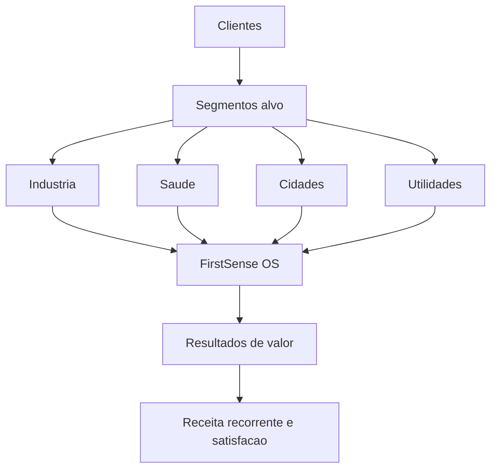

# Proposta de Valor 2030

Criamos resultados operacionais e de sustentabilidade atraves da FirstSense OS
- Tempo real com 6G e IoT para deteccao e atuacao
- IA generativa e previsiva para qualidade, manutencao e planeamento
- Robotica colaborativa para execucao segura e eficiencia
- Dados governados com contratos e auditoria integrada

Segmentos alvo e valor
- Industria manufatura: qualidade zero defeitos e OEE elevado
- Saude digital: fluxos seguros e camas inteligentes com deteccao de risco
- Cidades inteligentes: energia otimizada e seguranca proactiva
- Utilidades e energia: monitorizacao de redes e perdas tecnicas reduzidas

Jobs to be done e resultados
- Gestores de operacao: reduzir paragens e defeitos com previsao e atuacao
- Equipas de manutencao: planear janelas com risco e disponibilidade otimizados
- Clinicos e enfermagem: prevenir quedas e acelerar fluxo sem aumentar carga
- Gestores municipais: reduzir consumo e melhorar resposta a incidentes

Provas de valor em 12 semanas
- Definir baseline, sensores prioritarios e contratos de dados
- Implementar 1 a 2 modelos no edge com playbooks
- Medir impacto em KPIs acordados e preparar expansao

