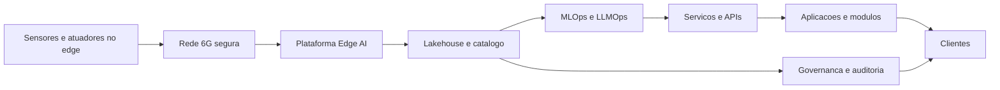

# Tecnologias Chave e Arquitectura

Nucleo tecnologico
- IoT e 6G para conectividade massiva e latencia baixa
- Edge AI para deteccao, previsao e atuacao local
- Data Lakehouse e contratos de dados para produto de dados
- MLOps e LLMOps para ciclo de vida de modelos e agentes
- Plataforma de robotica com gemelos digitais e seguro operacional

Arquitectura logica

Seguranca e privacidade por desenho
- Identidades fortes para dispositivos, servicos e dados
- Cifras, isolamento e observabilidade ponta a ponta
- Controles de acesso por atributo e contratos de uso de dados

