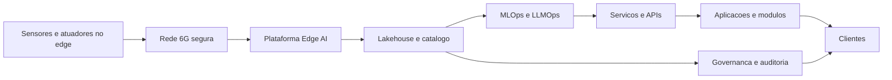

# Tecnologias Chave e Arquitectura

Nucleo tecnologico
- IoT e 6G para conectividade massiva e latencia baixa
- Edge AI para deteccao, previsao e atuacao local
- Data Lakehouse e contratos de dados para produto de dados
- MLOps e LLMOps para ciclo de vida de modelos e agentes
- Plataforma de robotica com gemelos digitais e seguro operacional

Arquitectura logica

Seguranca e privacidade por desenho
- Identidades fortes para dispositivos, servicos e dados
- Cifras, isolamento e observabilidade ponta a ponta
- Controles de acesso por atributo e contratos de uso de dados

Principios de arquitectura
- Cloud agnostico com camadas portaveis e infra como codigo
- Malha de dados com contratos, linhagem e catálogos por dominio
- Edge first para casos de latencia e resiliencia
- Testes automatizados e canary para modelos e agentes
- Observabilidade com SLOs por fluxo e alerta baseado em risco

SLOs e operacao
- Latencia p95 inferior a 100 ms no edge para atuacao critica
- Confiabilidade mensal superior a 99.9 por cento nos modulos core
- Recovery time objetivo inferior a 15 minutos no edge
