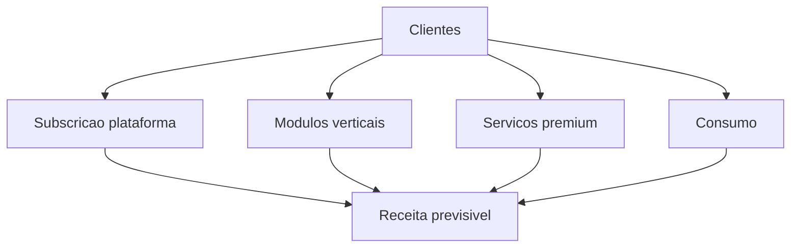

# Modelo de Negocio

Componentes
- Subscricao da plataforma FirstSense OS por cliente e dominio
- Marketplace de modulos por caso de uso
- Servicos de integracao, migração e suporte premium
- Receita baseada em consumo para eventos, processamento e armazenamento
- Partilha de receita com parceiros e developers

Fontes de receita
- Licenca anual de plataforma por tier
- Consumo por milhao de eventos e horas de computacao
- Modulos verticais com precos por resultado
- Suporte e SLOs de alta criticidade

Custos principais
- Engenharia de plataforma e produto
- Operacao cloud e edge
- Parcerias, certificacoes e conformidade
- Suporte e sucesso do cliente

