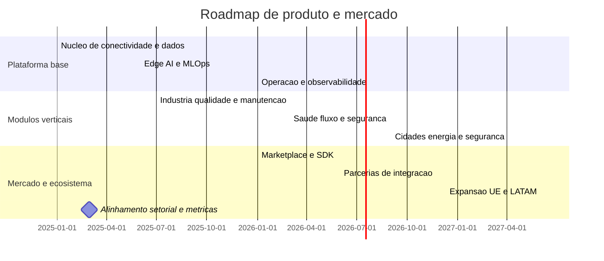

# Roadmap 2025 a 2030

Marcos
- Primeiros casos pagos em 2025 quarto
- Marketplace aberto em 2026 quarto
- Certificacoes setoriais chave em 2027
- Posicao lider em 2030 em dois dominios

## Casos de uso prioritarios e metricas alvo 2025 a 2027

Industria manufatura
- Qualidade zero defeitos
  - Defeitos por milhao reduzidos para 300 por 2026
  - Taxa de primeira passagem melhorada em 2 pontos percentuais por semestre
- Manutencao preditiva
  - Tempo medio entre falhas aumentado em 25 por cento ate 2026
  - Paragens nao planeadas reduzidas em 30 por cento ate 2026
  - Tempo de reposicao de pecas reduzido em 20 por cento
- Seguranca operacional
  - Near miss reportados aumentados em 50 por cento
  - Incidentes com danos reduzidos em 40 por cento ate 2027

Saude digital
- Quedas em enfermarias e long term care
  - Reducao de 35 por cento na taxa de quedas ate 2026
  - Tempo de resposta a alarmes inferior a 30 segundos p95
  - Ocupacao de camas otimizada em 8 por cento
- Fluxo de pacientes
  - Tempo de espera em triagem reduzido em 25 por cento
  - No show reduzido em 20 por cento por via de alertas e remarcacao

Cidades inteligentes
- Energia publica e edificios
  - Consumo de iluminacao publica reduzido em 40 por cento com controlo adaptativo
  - Pico de demanda reduzido em 15 por cento em horas criticas
  - Emissoes CO2e reduzidas em 25 por cento sobre baseline 2025
- Seguranca urbana
  - Tempo de deteccao de incidentes reduzido em 60 por cento
  - Tempo de despacho de ocorrencias reduzido em 30 por cento

Utilidades e energia
- Perdas tecnicas e nao tecnicas
  - Perdas totais reduzidas em 20 por cento ate 2027
  - SAIDI reduzido em 15 por cento e SAIFI em 10 por cento
- Prevencao de falhas em rede
  - Precisao de previsao superior a 85 por cento p90
  - Aviso preditivo com antecedencia superior a 48 horas p80

Metricas transversais de sucesso
- Time to value inferior a 12 semanas por caso
- NPS aumentado em 15 pontos
- Receita recorrente anual por cliente aumentada em 20 por cento ano sobre ano
- Precisao de modelos acima de 80 por cento p90 e deriva controlada
- Cobertura de auditoria e linhagem de dados em 100 por cento dos fluxos criticos
- Reducao de pegada de carbono por unidade de valor entregue em 30 por cento ate 2027
