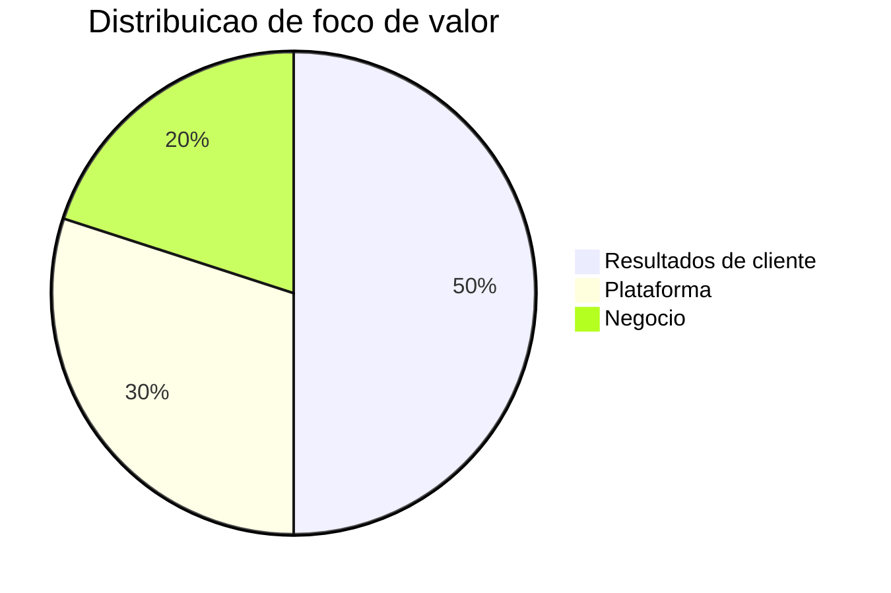

# Metricas e KPIs

Resultados de cliente
- Reducao de tempo de paragem não planeada
- Melhoria de OEE e produtividade
- Reducao de consumo energetico e emissões
- Tempo de resolucao de incidentes

Plataforma
- Eventos processados por segundo e latencia
- Custos por unidade de valor entregue
- Adocao de modulos por cliente
- Precisao e robustez de modelos

Negocio
- Receita recorrente anual
- Churn e net revenue retention
- Margem bruta por produto
- Payback de aquisicao

