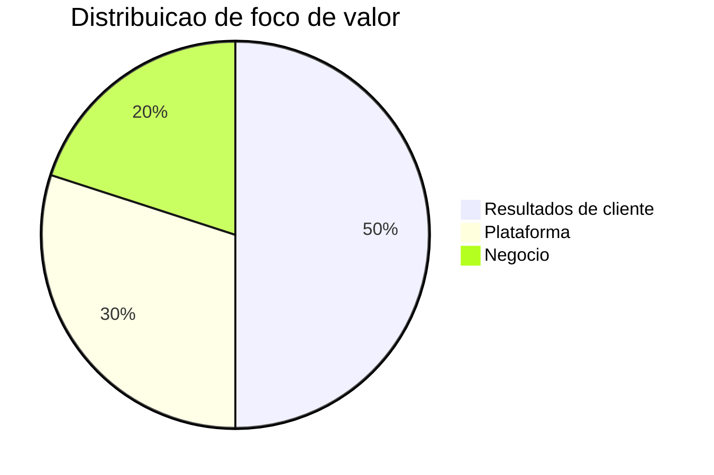

# Metricas e KPIs

Resultados de cliente
- Reducao de tempo de paragem não planeada
- Melhoria de OEE e produtividade
- Reducao de consumo energetico e emissões
- Tempo de resolucao de incidentes

Plataforma
- Eventos processados por segundo e latencia
- Custos por unidade de valor entregue
- Adocao de modulos por cliente
- Precisao e robustez de modelos

Negocio
- Receita recorrente anual
- Churn e net revenue retention
- Margem bruta por produto
- Payback de aquisicao

Mapa de metricas por setor e frequencia
- Industria manufatura
  - OEE e paragens nao planeadas: semanal
  - Defeitos por milhao e primeira passagem: mensal
  - Incidentes e near miss: mensal
- Saude digital
  - Taxa de quedas e tempo de resposta p95: semanal
  - Tempo de espera em triagem e no show: mensal
- Cidades inteligentes
  - Consumo energetico e pico de demanda: semanal
  - Tempo de deteccao e despacho: semanal
- Utilidades e energia
  - SAIDI e SAIFI: mensal
  - Perdas totais e previsao de falhas p90: mensal

Balanced Scorecard
- Financeiro: ARR, margem bruta, payback
- Clientes: NPS, satisfacao por caso de uso
- Processos: SLO de latencia e disponibilidade, tempo de deploy
- Aprendizagem: ciclos de melhoria de modelos, cobertura de testes
