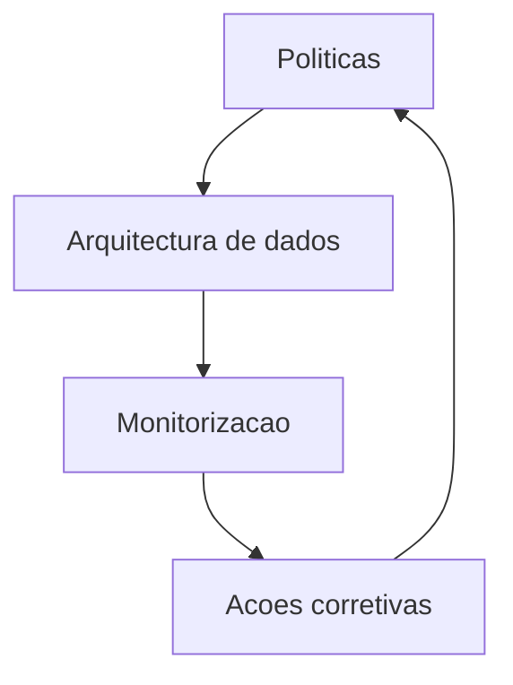

# Governanca de Dados e Etica

Politicas
- Dados como produto com contrato, linhagem e qualidade
- Acesso por atributo e minimizacao de dados
- Auditoria, explainability e testes de harmonia para modelos
- Canal de revisao etica e aprovacao para casos sensiveis

Controlo operacional
- Catálogo de dados, malha de dados e lakehouse
- Monitorizacao de deriva de dados e modelos
- Playbooks de resposta e revisao humana

