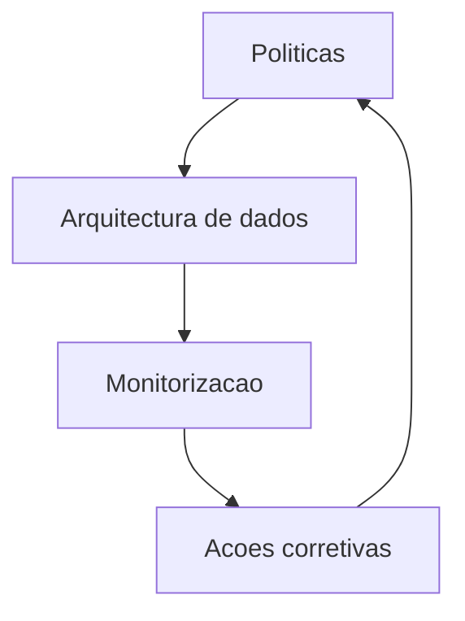

# Governanca de Dados e Etica

Politicas
- Dados como produto com contrato, linhagem e qualidade
- Acesso por atributo e minimizacao de dados
- Auditoria, explainability e testes de harmonia para modelos
- Canal de revisao etica e aprovacao para casos sensiveis

Controlo operacional
- Catálogo de dados, malha de dados e lakehouse
- Monitorizacao de deriva de dados e modelos
- Playbooks de resposta e revisao humana

Normas e conformidade
- GDPR e DGA para protecao e partilha responsavel de dados
- AI Act com classificacao de risco e gestao de conformidade
- ISO 27001 e NIS2 para seguranca e resiliencia
- ISO IEC 42001 para gestao de IA
- IEC 62443 para ambientes OT

Governanca de modelos
- Data cards e model cards documentados
- Aprovacao multiparte interessada para modelos de alto risco
- Monitorizacao de viés, desempenho e deriva com limiares
- Processo de retirada segura e explainability obrigatoria

RACI resumido
- Responsavel: equipas de dados e produto
- Aprovador: comite de risco e etica
- Consultado: juridico, seguranca, clientes
- Informado: operacao e parceiros
