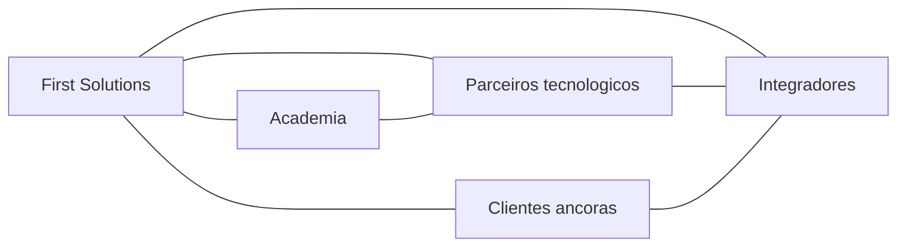

# Parcerias e Ecosistema

Tipos de parceria
- Tecnologicos para cloud, 6G e robotica
- Integradores e consultoria para entrega
- Academia para I&D e talento
- Clientes ancoras como co inovadores

Mapa de ecosistema

