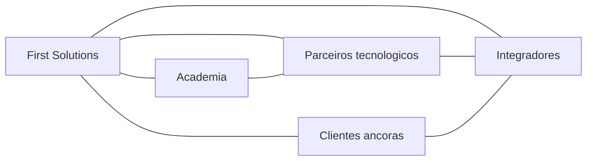

# Parcerias e Ecosistema

Tipos de parceria
- Tecnologicos para cloud, 6G e robotica
- Integradores e consultoria para entrega
- Academia para I&D e talento
- Clientes ancoras como co inovadores

Mapa de ecosistema

Criterios de selecao e governanca
- Alinhamento tecnico e de roadmaps
- Certificacoes de seguranca e conformidade
- Modelo de suporte e SLOs compatíveis
- Acordos de partilha de receita e dados

Tiers de parceiros
- Estrategicos: core cloud e hardware
- Solucao: modulos verticais e ISVs
- Entrega: integradores regionais
- Academia: laboratorios e programas de talento
