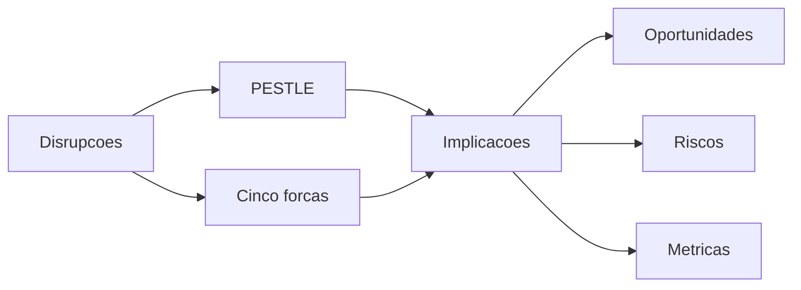

# Contexto e Tendencias 2025 a 2030

Disrupcoes chave 2025 a 2030
- IA generativa e agentes para planeamento, apoio a decisao e codigo de robots
- Robotica terrestre e aerea para terraplanagem, assentamento, inspecao e logistica
- IoT e 6G para telemetria, posicionamento e controlo de atuadores em obra
- Gemeos digitais ligados a BIM para simulacao e verificacao de conformidade
- Internet dos Sentidos em casos de formacao e apoio remoto
- Sustentabilidade com medicao de carbono, residuos e circularidade
- Regulacao de IA e maquinas com requisitos de risco, seguranca e auditoria

Analise PESTLE
- Politico: investimento publico em infraestruturas e exigencias de resiliencia
- Economico: pressao por produtividade e custos de materiais variaveis
- Social: escassez de mao de obra e foco em seguranca no terreno
- Tecnologico: edge AI, SLAM, Lidar, visao por computador, drones e malhas 6G
- Legal: Regulamento de Maquinas UE, AI Act, NIS2, GDPR, normas ISO
- Ambiental: metas de carbono, gestao de residuos e eficiencia de materiais

Cinco forcas de Porter
- Rivalidade: elevada entre empreiteiros e fornecedores de software de obra
- Clientes: poder medio alto em contratos e penalidades
- Fornecedores: poder medio com dependencia de OEMs e cloud
- Substitutos: metodos tradicionais e plataformas generalistas
- Barreiras de entrada: elevadas por capital, dados, certificacao e integracoes

Implicacoes para a empresa
- Migrar de servicos ad hoc para plataforma de orquestracao robotica e dados
- Adotar edge first com ligacao a BIM e contratos de dados
- Criar playbooks por tarefa com entrega repetivel e audivel
- Estabelecer programa de conformidade e seguranca funcional
- Formar equipas em operacao de robots, IA e HSE
- Estruturar parcerias com OEMs, telcos e fornecedores BIM

Oportunidades por tipo de obra
- Infraestruturas: terraplanagem, compactacao e pavimentacao com automacao
- Edificacao: assentamento, cofragem, betonagem e acabamento com QA ligado a BIM
- Renovaveis: instalacao de estruturas e inspecao de parques com drones e robots

Riscos e sinais de alerta
- Ciberseguranca e interrupcoes operacionais com monitorizacao e resposta
- Variabilidade de terreno e clima mitigada por simulacao e redundancia
- Aceitacao social e laboral com comunicacao e formacao
- Cadeia de abastecimento de OEMs com alternativas e contratos de saida
- Regulação acompanhada por normas e auditorias

Metricas e indicadores
- Producao: CPI e SPI por fase de obra
- Qualidade: rework e defeitos por secao
- Seguranca: LTIFR, TRIR e near miss
- Operacao: percentagem de tarefas automatizadas e tempo de resposta a incidentes
- Sustentabilidade: emissões CO2e e residuos por unidade de producao

Resumo visual

Disrupcoes chave na construcao
- Robotica de terraplanagem, assentamento, armacao, betonagem e inspeçao
- Drones e scanners para progresso, volumetria e controlo de qualidade
- IoT e 6G para telemetria, posicionamento e orquestraçao de frotas
- IA generativa e visao para planeamento, QA e copilotos de obra
- BIM ligado a gemeos digitais de obra com simulaçao
- Pressao ESG com materiais, residuos e carbono monitorizados

PESTLE resumido
- Politico e legal: Regulamento de Maquinas UE, AI Act, NIS2, normas ISO 12100 e 10218
- Economico: escassez de mao de obra e compressao de margens com variabilidade de materiais
- Social: seguranca e dignidade do trabalho, aceitacao de robots
- Tecnologico: edge AI, SLAM, Lidar, CV, 6G e mesh em obra
- Ambiental: requisitos de circularidade e reducao de residuos

Implicacoes para a empresa
- Migrar de empreitada intensiva em Mão de obra para orquestração de robotica e dados
- Padronizar tarefas com playbooks e módulos reutilizáveis
- Dados como produto com contratos ligados a BIM e auditoria
- Edge first em obra com conectividade resiliente
