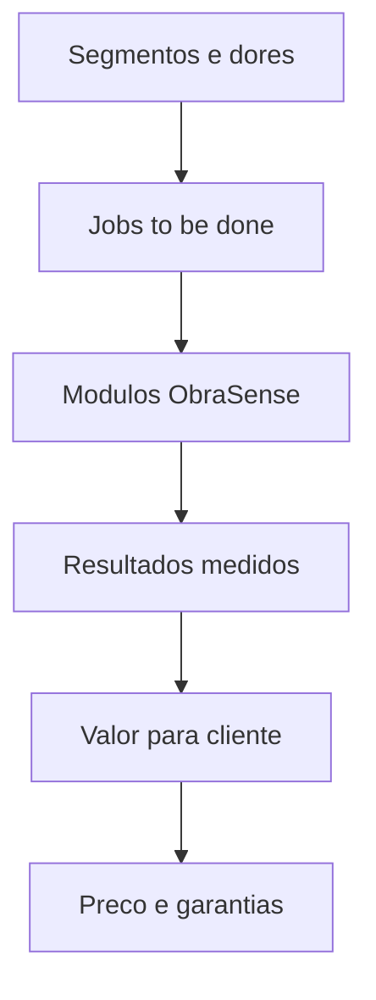

# Proposta de Valor 2030

Proposta de valor central
Entregar obras com prazo, custo, qualidade e seguranca controlados, combinando robotica, IA, IoT e BIM numa plataforma unica ObraSense OS.

Segmentos alvo e dores
- Donos de obra: previsibilidade de prazo e custo, conformidade
- Empreiteiros gerais: produtividade, rework, controlo de subcontratos
- Especialidades: seguranca, qualidade, coordenacao de equipas

Jobs to be done e resultados
- Direcao de obra: cumprir plano e budget com desvios visiveis em horas
- QA QC: detetar defeitos e nao conformidades a tempo
- Seguranca: reduzir exposicao e tempo em tarefas de risco
- Logistica: garantir materiais e equipamentos no ponto certo

Beneficios e metricas alvo
- Prazo: SPI superior a 1.05 por fase
- Custo: CPI superior a 1.05 e variacao reduzida
- Qualidade: rework e defeitos por secao reduzidos em 30 por cento
- Seguranca: LTIFR e TRIR reduzidos em 40 por cento ate 2027
- Sustentabilidade: emissoes e residuos por unidade reduzidos em 25 por cento

Diferenciacao
- Orquestracao de frotas roboticas com BIM e gemeo digital
- Contratos de dados e auditoria integrados
- Edge first para obra com conectividade mesh 6G
- Biblioteca de playbooks por tarefa

Oferta modular
- Fase terreno: terraplanagem, compactacao, pavimentacao
- Fase estrutura: armacao, cofragem, betonagem
- Fase acabamentos: assentamento, pintura, inspecao com visao
- Transversal: logistica, seguranca, progresso e carbono

Modelo de precos e garantias
- Subscricao por obra e portfolio com tiers
- Consumo por hora robotica e eventos
- Modulos por resultado com metas de CPI SPI ou qualidade
- Garantias de performance com marcos de valor e creditos de servico

Prova de valor 12 semanas
- Semana 1 a 2: baseline, BIM, sensores e contratos de dados
- Semana 3 a 6: implementacao de 1 a 2 modulos prioritarios
- Semana 7 a 10: calibracao e treino operacional
- Semana 11 a 12: medicao de impacto e plano de expansao

Resumo visual

