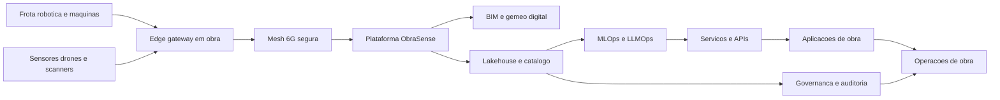

# Tecnologias Chave e Arquitectura

Nucleo tecnologico
- Robotica terrestre e aerea com SLAM, planeamento e seguranca funcional
- IoT e 6G site mesh para posicionamento e telemetria em tempo real
- Edge AI para deteccao, previsao e atuacao em obra
- BIM e gemeo digital com simulacao e controlo de qualidade
- Data Lakehouse com contratos de dados e catalogo
- MLOps e LLMOps para ciclo de vida de modelos e agentes

Arquitectura logica

Seguranca e privacidade por desenho
- Identidades fortes para robots, dispositivos e servicos
- Segmentacao de rede, cifragem e observabilidade ponta a ponta
- Controles de acesso por atributo e contratos de uso de dados

SLOs e operacao
- Latencia p95 inferior a 150 ms para atuacao critica
- Confiabilidade mensal superior a 99.5 por cento em obra
- Recuperacao no edge inferior a 15 minutos

