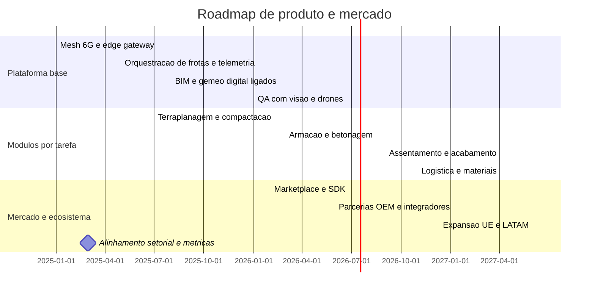

# Roadmap 2025 a 2030

Casos de uso e metricas alvo 2025 a 2027

Terraplanagem e pavimentacao
- Produtividade de movimento de terras aumentada em 25 por cento ate 2026
- Precisao de cotas e declives com tolerancia inferior a 2 cm p95
- Consumo de combustivel reduzido em 15 por cento

Armacao e betonagem
- Taxa de rework reduzida em 30 por cento
- Ciclo de cofragem acelerado em 20 por cento
- Conformidade de cura e resistencia com deteccao precoce de desvios

Assentamento e acabamento
- Defeitos por secao reduzidos em 40 por cento
- RFI cycle time reduzido em 30 por cento
- Produtividade por equipa aumentada em 20 por cento

Seguranca e operacao
- LTIFR e TRIR reduzidos em 40 por cento ate 2027
- Near miss reportados aumentados em 50 por cento com cultura positiva
- Tempo de resposta a incidentes inferior a 60 segundos p95

Metricas transversais
- CPI superior a 1.05 e SPI superior a 1.05 por fase
- Tempo de deteccao de desvios inferior a 24 horas
- Reducao de residuos de obra em 25 por cento

