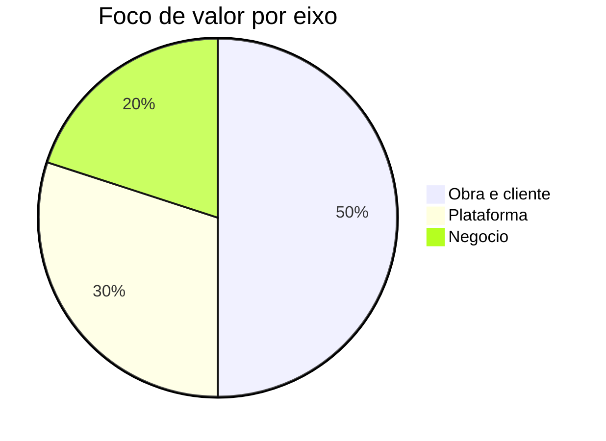

# Metricas e KPIs

Resultados de obra
- CPI e SPI por fase de obra
- Percentagem de tarefas automatizadas por tipologia
- Rework e defeitos por secao
- LTIFR e TRIR
- RFI cycle time

Plataforma
- Latencia p95 no edge e disponibilidade
- Eventos por segundo e throughput de video
- Precisao e robustez de modelos em obra
- Custos por unidade de valor entregue

Negocio
- Receita recorrente anual e por obra
- Margem bruta por produto e servico
- Churn e net revenue retention
- Payback de aquisicao

Mapa de metricas por tarefa e frequencia
- Terraplanagem: produtividade, precisao e combustivel semanal
- Armacao e betonagem: rework, ciclo e conformidade semanal
- Assentamento e acabamento: defeitos e RFI semanal
- Seguranca: LTIFR e TRIR mensal, near miss semanal

Balanced Scorecard
- Financeiro: ARR, margem, payback
- Clientes: NPS, satisfacao por obra e modulo
- Processos: SLO de latencia e disponibilidade, tempo de deploy
- Aprendizagem: ciclos de melhoria de modelos, cobertura de testes

