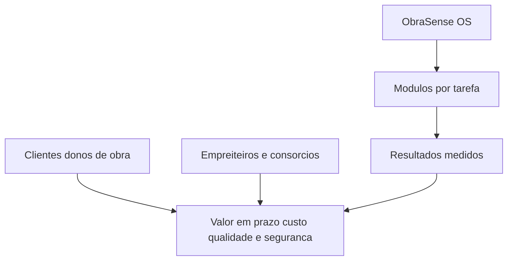

# Proposta de Valor 2030

Criamos obras mais rapidas, seguras e sustentaveis com ObraSense OS
- Orquestra frotas roboticas e maquinas inteligentes
- Verifica qualidade com visao computacional ligada a BIM
- Monitoriza progresso e custos em tempo quase real
- Otimiza logistica, materiais e carbono

Segmentos alvo e valor
- Infraestruturas: terraplanagem e pavimentacao com maior produtividade e precisao
- Edificacao: assentamento e acabamento com menor rework e maior qualidade
- Renovaveis: parques solares e eolicos com instalacao acelerada e segura

Jobs to be done
- Direcao de obra: cumprir prazo e budget com previsibilidade
- QA: reduzir defeitos e inspeccionar sem atrasos
- Seguranca: diminuir exposicao a risco e incidentes

Provas de valor em 12 semanas
- Baseline de produtividade e qualidade com BIM
- Implementacao de 1 a 2 modulos em tarefas de alto impacto
- Medicao de CPI e SPI e plano de expansao

