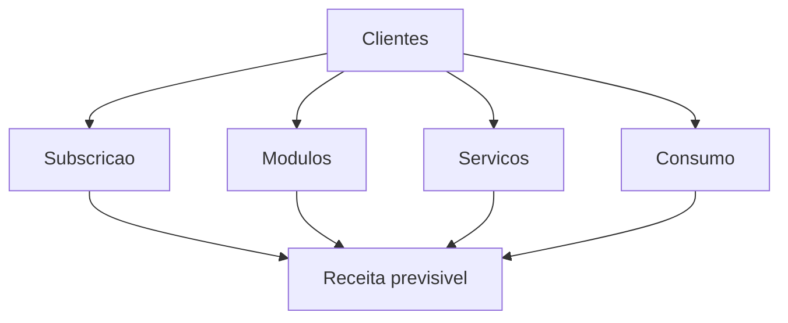

# Modelo de Negocio

Componentes
- Subscricao da plataforma ObraSense OS por obra e por portfolio
- Marketplace de modulos por tarefa e fase da obra
- Servicos de engenharia, integraçao, comissionamento e suporte
- Receita baseada em consumo por horas roboticas, eventos e armazenamento
- Partilha de receita com parceiros e OEMs

Fontes de receita
- Licenca anual e por obra com tiers
- Consumo por hora robotica e processamento no edge e cloud
- Modulos verticais com precificacao por resultado
- Suporte premium e SLOs criticos

Business Model Canvas resumido
- Proposta: acelerar prazos, reduzir custos e incidentes com robotica e IA
- Segmentos: donos de obra e empreiteiros em infra, edificacao e renovaveis
- Canais: equipa direta, integradores e OEMs
- Relacoes: sucesso do cliente em obra e SLAs
- Atividades: engenharia, dados, MLOps, entrega e operacao
- Recursos: dados de obra, IP, parcerias e equipa
- Parcerias: OEMs, telcos 6G, integradores e academia
- Custos: cloud e edge, I&D, certificacao, suporte
- Receita: subscricao, modulos, consumo e suporte

Unit economics e comercial
- Entrada land and expand com piloto pago e marcos de valor
- Payback alvo inferior a 9 meses
- Margem bruta alvo superior a 65 por cento em software

