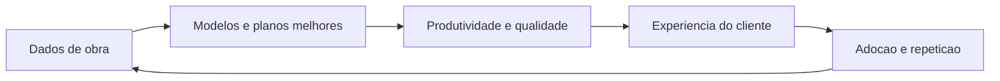

# Vantagem Competitiva Sustentavel

Fontes de defensibilidade
- Flywheel de dados de obra e modelos por tarefa
- Contratos de dados ligados a BIM e auditoria de qualidade
- Biblioteca de playbooks de obra e integraçoes com OEMs
- Certificacoes de seguranca e conformidade em ambiente de obra

Flywheel de valor

VRIO em alto nivel
- Valor: melhora prazo custo seguranca e qualidade
- Raridade: datasets proprietarios de produtividade por tarefa e contexto
- Imitabilidade: dificil sem dados, playbooks e certificacoes
- Organizacao: estrutura de produto, dados e entrega em obra

Custos de mudanca saudaveis
- Dados e integraçoes preservados com exportacao e APIs abertas
- Playbooks e dashboards adaptados ao cliente e aplicaveis em novas obras

