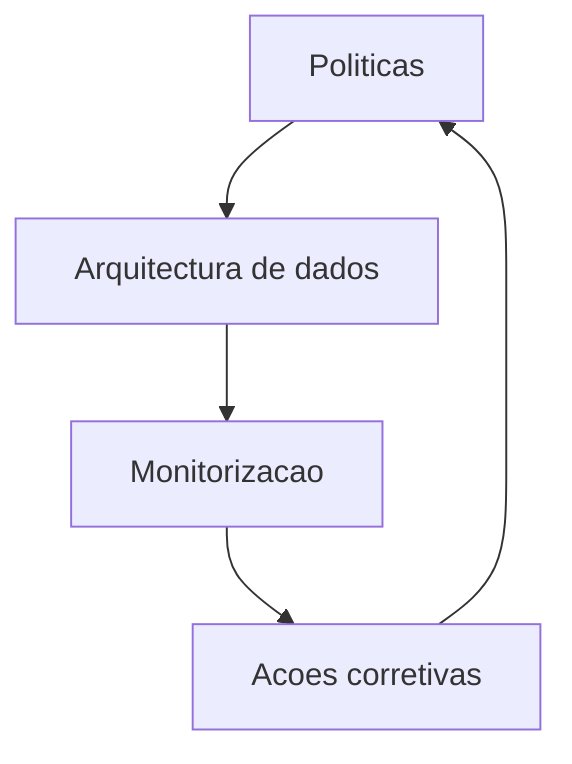

# Governanca de Dados e Etica

Politicas
- Dados como produto com contrato, linhagem e qualidade ligados a BIM
- Acesso por atributo e minimizacao de dados
- Auditoria, explainability e testes de seguranca para modelos e robots
- Canal de revisao etica e aprovacao para casos sensiveis

Controlo operacional
- Catalogo e contratos de dados, malha de dados e lakehouse
- Monitorizacao de deriva de dados, modelos e performance robotica
- Playbooks de resposta e revisao humana em tarefas criticas

Normas e conformidade
- Regulamento de Maquinas UE e marcacao CE
- ISO 12100 e ISO 10218 para seguranca de maquinas e robotica
- IEC 61508 e ISO 13849 para seguranca funcional
- GDPR, DGA e AI Act para dados e IA
- NIS2 e ISO 27001 para seguranca e resiliencia

Governanca de modelos e robots
- Data cards e model cards
- Aprovacao multiparte para tarefas de alto risco
- Monitorizacao de bias, desempenho e deriva
- Processo de retirada segura e explainability obrigatoria

RACI resumido
- Responsavel: equipas de dados, robotica e produto
- Aprovador: comite de risco, seguranca e etica
- Consultado: juridico, HSE, clientes e OEMs
- Informado: operacao e parceiros

