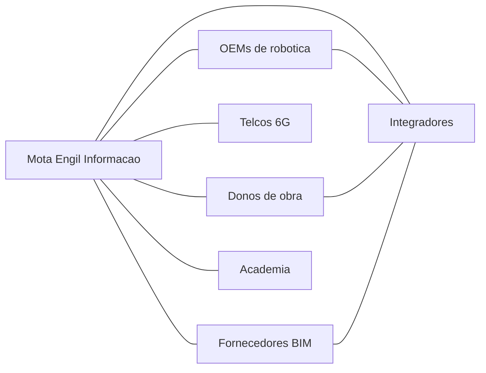

# Parcerias e Ecosistema

Tipos de parceria
- OEMs de robotica e maquinas inteligentes
- Telcos e integradores 6G para conectividade em obra
- Fornecedores de BIM e software AEC
- Integradores e consultoras de construcao
- Academia de robotica e engenharia civil
- Donos de obra como co inovadores

Mapa de ecosistema

Criterios de selecao e governanca
- Alinhamento tecnico e de roadmaps
- Certificacoes de seguranca e conformidade
- Suporte em campo e SLOs
- Modelos de partilha de receita e dados

Tiers de parceiros
- Estrategicos: OEMs core, telcos e BIM
- Solucao: modulos verticais e ISVs
- Entrega: integradores regionais
- Academia: laboratorios e programas de talento

