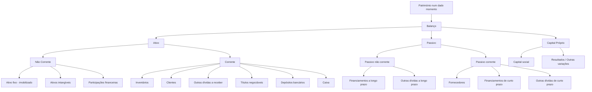

# Notas de aulas - Contabilidade - IAG1

> **Objetivo**: consolidar as tuas notas com terminologia correta, estrutura lógica e pontos de exame frequentes, alinhados com o **SNC – Sistema de Normalização Contabilística**, com referências oficiais/credíveis.

---

## Parte I - Fundamentos da Contabilidade

### 1) O que é a Contabilidade?

- **Definição nuclear** (ótica financeira): sistema de **registo, mensuração e comunicação** de factos económico-financeiros de uma entidade, preparado para fins gerais (investidores, credores, Estado, etc.). A **Estrutura Conceptual** determina os conceitos e critérios subjacentes às demonstrações financeiras.
- **Características qualitativas** da informação financeira útil: **relevância** e **representação fiel** (fundamentais); **comparabilidade, verificabilidade, tempestividade e compreensibilidade** (de melhoria).

#### 1.1 Sentido estrito vs. sentido amplo

- **Sentido estrito**: "técnica de revelação patrimonial" — regista e representa **todas as transações** que afetam o **património** (ativo, passivo, capital próprio), culminando em demonstrações financeiras (Balanço, DR, DFC, etc.).
- **Sentido amplo**: inclui práticas e subsistemas **internos** de informação para a gestão (planeamento, controlo, decisão), i.e., **Contabilidade de Gestão**, ainda que **não obrigatória** e **livremente desenhada** pela organização.

---

### 2) Ramos principais

#### 2.1 Contabilidade Financeira (externa)

- **Objeto**: registo das operações com terceiros, **modificações do património** e **apuramento de resultados**, para **utilizadores externos** (acionistas, financiadores, fornecedores, reguladores, AT, etc.).
- **Obrigatoriedade/normas**: é **obrigatória por lei** e segue o **SNC** (NCRF/NCP), harmonizado com a IFRS. Modelos oficiais de **demonstrações financeiras** aprovados por portaria.
- **Demonstrações financeiras típicas (SNC)**:
  **Balanço**, **Demonstração dos Resultados** (por naturezas), **Demonstração das Alterações no Capital Próprio**, **Demonstração dos Fluxos de Caixa** e **Anexo/Notas**.
- **Base de preparação**: **regime do acréscimo**; reconhecimento de **ativos, passivos, capital próprio, rendimentos e gastos** conforme a Estrutura Conceptual.

#### 2.2 Contabilidade de Gestão (interna)

- **Sinónimos**: contabilidade **analítica**, **industrial**, **de custos**.
- **Finalidade**: apurar **custos** de produtos/serviços, analisar **margens/desempenho** por negócio/mercado/centro de responsabilidade; **planear**, **controlar** e **suportar decisões**.
- **Obrigatoriedade**: **não é obrigatória**; **não está normalizada**—formatos e relatórios **definidos internamente** segundo a estratégia/processos.

> **Exame/Dica**: "Financeira" = fora/obrigatória/padronizada (SNC); "Gestão" = dentro/flexível/orientada à decisão.

---

### 3) Património e Balanço

- **Património** (num dado momento): **conjunto de bens, direitos e obrigações** de uma entidade. Em Balanço, estrutura-se em **Ativo**, **Passivo** e **Capital Próprio** (equação: **Ativo = Passivo + Capital Próprio**).

#### 3.1 Elementos (definições de referência)

- **Ativo**: **recurso controlado** pela entidade como resultado de acontecimentos passados, do qual se **esperam benefícios económicos futuros**.
- **Passivo**: **obrigação presente** proveniente de eventos passados, cuja liquidação se espera que **provoque saída de recursos**.
- **Capital próprio**: **interesse residual** nos ativos depois de deduzidos todos os passivos.

#### 3.2 Classificação corrente vs. não corrente

- O **SNC** exige distinguir **corrente**/**não corrente** no Balanço; a **NCRF 1** define os critérios e estrutura de apresentação.

---

### 4) Mapas e rubricas (exemplos práticos)

#### 4.1 Obrigações (lado do financiamento)

- **Aos sócios** → **Capital Próprio**: *Capital social*, *Resultados acumulados/período*, *Outras variações no capital próprio*.
- **A terceiros** → **Passivo**:
  - **Não corrente**: *Financiamentos a longo prazo*, *Outras dívidas a longo prazo*.
  - **Corrente**: *Fornecedores*, *Financiamentos de curto prazo*, *Outras dívidas a curto prazo*.

#### 4.2 Bens e direitos (lado dos investimentos)

- **Ativo não corrente**: *Ativo fixo tangível (imobilizado)*, *Ativos intangíveis*, *Participações financeiras*.
- **Ativo corrente (circulante)**: *Inventários*, *Clientes*, *Outras dívidas a receber*, *Títulos negociáveis*, *Depósitos bancários*, *Caixa*.

---

### 5) Esquema visual (Mermaid)

### 6) Checklist de estudo

- [ ] **Distinguir** Contabilidade **Financeira** vs. **Gestão** (objetivo, utilizadores, obrigatoriedade, normalização).
- [ ] **Definições** de **Ativo/Passivo/Capital Próprio** e **base do acréscimo**.
- [ ] **Modelos do SNC**: reconhecer e saber o propósito de cada um (Balanço, Demonstração de Resultados, Demonstração dos Fluxos de Caixa, Demonstração das Alterações no Capital Próprio, Anexo).
- [ ] **Classificação** corrente vs. não corrente e **exemplos** típicos de rubricas em cada categoria.
- [ ] **Qualidade da informação**: relevância e representação fiel (fundamentais); comparabilidade, verificabilidade, tempestividade e compreensibilidade (de melhoria).

---

### 7) Referências essenciais (consulta rápida)

- **CNC – Comissão de Normalização Contabilística**: Estrutura Conceptual, NCRF 1 e restantes normas; modelos oficiais de demonstrações financeiras.
- **SNC (legislação de base)**: enquadramento legal e princípios (inclui regime do acréscimo e critérios de reconhecimento/medição).
- **IFRS Foundation – Conceptual Framework**: definições dos elementos das demonstrações e características qualitativas.
- **Portaria dos modelos de DF** (Diário da República): formatos padronizados de Balanço, DR, DFC, DAPC e Anexo.
- **Materiais formativos** (OCC, universidades): guias práticos, casos e exercícios.

---

> **Mnemónica útil**
> **Ativo traz benefícios**; **Passivo exige saídas**; **Capital Próprio é o residual**.
> **Financeira = fora & normas**; **Gestão = dentro & decisão**.

---

## Parte II - Método Contabilístico e Factos Patrimoniais

### 8) Factos Patrimoniais

**Definição**: Factos patrimoniais são todas as operações que criam uma dinâmica patrimonial, provocando variações quantitativas e qualitativas no património da empresa, sendo passíveis de se determinar um valor monetário.

**Classificação dos Factos Patrimoniais**:

1. **Factos Patrimoniais Permutativos (Qualitativos ou Compensativos)**
   - Alteram a composição do património sem alterar o seu valor
   - Modificam apenas a natureza dos elementos patrimoniais envolvidos
   - Não afetam o capital próprio

2. **Factos Patrimoniais Modificativos (Quantitativos)**
   - Alteram a composição do património e modificam a situação líquida
   - **Modificativos aumentativos**: aumentam o capital próprio (ex: rendimentos)
   - **Modificativos diminutivos**: diminuem o capital próprio (ex: gastos)

3. **Factos Patrimoniais Mistos (Compostos)**
   - Envolvem simultaneamente um facto permutativo e um facto modificativo
   - Alteram o património líquido através da troca de elementos com lucro ou prejuízo

#### 8.1 Exemplos de Factos Patrimoniais

- **Realização do capital social** (Permutativo)
  - Entrada de dinheiro ou outros bens por parte dos sócios
  - Débito: Caixa/Depósitos bancários | Crédito: Capital social

- **Compra, a crédito, de mercadoria para venda (inventário)** (Permutativo)
  - Aumento de ativos (inventário) e passivos (fornecedores)
  - Débito: Mercadorias/Inventários | Crédito: Fornecedores

- **Compra de um computador** (Permutativo se pago a pronto; Misto se com descontos)
  - Aquisição de ativo fixo tangível
  - Débito: Equipamento básico | Crédito: Caixa/Banco ou Fornecedores de imobilizado

- **Pagamento de renda** (Modificativo diminutivo)
  - Gasto que diminui o ativo e o capital próprio
  - Débito: Rendas e alugueres (Classe 6) | Crédito: Caixa/Banco

- **Vender a crédito** (Misto)
  - Aumento de clientes (ativo) e rendimento (capital próprio)
  - Débito: Clientes | Crédito: Vendas de mercadorias (Classe 7)

- **Recebimento do crédito cedido ao cliente** (Permutativo)
  - Diminuição de clientes e aumento de disponibilidades
  - Débito: Caixa/Banco | Crédito: Clientes

---

### 9) Método de Registo Digráfico ou das Partidas Dobradas

**Origem histórica em Portugal**: Em 28 de junho de 1808, a Corte Portuguesa emitiu um decreto que tornou obrigatória a escrituração mercantil por partidas dobradas, descrevendo-a como "a única seguida pelas nações mais civilizadas" devido à sua brevidade no manejo de grandes somas e clareza, deixando menos margem para erros e fraudes.

**Princípio fundamental**:

- Cada transação financeira é registada em pelo menos duas contas, com direções opostas (débitos e créditos)
- O total dos débitos deve ser sempre igual ao total dos créditos
- Garante que a equação contabilística se mantém equilibrada: **Ativo = Passivo + Capital Próprio**

**Equação alternativa**: Capital Próprio = Ativo - Passivo

---

### 10) Contas e Regras de Movimentação

#### 10.1 Contas de Ativo

- **Natureza**: Devedora
- **Débito**: Aumenta o património (entrada de bens ou direitos)
- **Crédito**: Diminui o património (saída de bens ou direitos)
- **Exemplos**: Caixa, Depósitos bancários, Clientes, Inventários, Equipamentos

#### 10.2 Contas de Passivo

- **Natureza**: Credora
- **Débito**: Diminui o património (pagamento de dívidas)
- **Crédito**: Aumenta o património (assunção de obrigações)
- **Exemplos**: Fornecedores, Empréstimos obtidos, Estado e outros entes públicos

#### 10.3 Contas de Gastos (Classe 6)

- **Natureza**: Devedora
- **Débito**: Aumenta os gastos (registo de consumos, despesas)
- **Crédito**: As contas de gasto, por norma, não são creditadas (exceto em regularizações ou anulações)
- **Exemplos**: Custo das mercadorias vendidas, Fornecimentos e serviços externos, Gastos com pessoal

#### 10.4 Contas de Rendimentos (Classe 7)

- **Natureza**: Credora
- **Débito**: Diminui os rendimentos (anulações, devoluções) - raramente utilizado
- **Crédito**: Aumenta os rendimentos (registo de vendas, prestação de serviços)
- **Exemplos**: Vendas de mercadorias, Prestações de serviços, Juros obtidos

#### 10.5 Contas de Capital Próprio (Classe 5)

- **Natureza**: Credora (representa os recursos dos proprietários)
- **Débito**: Diminui o capital próprio (distribuição de lucros, prejuízos, diminuição de capital)
- **Crédito**: Aumenta o capital próprio (realizações de capital, lucros, subsídios)
- **Definição**: O capital próprio é o interesse residual nos ativos da entidade depois de deduzir todos os seus passivos
- **Exemplos**: Capital social, Reservas, Resultados transitados

---

### 11) Apuramento de Resultados

O apuramento de resultados é o processo de determinação do lucro ou prejuízo do exercício, através da comparação entre rendimentos (Classe 7) e gastos (Classe 6).

**Processo**:

1. No final do período, transferem-se todos os saldos das contas de gastos (Classe 6) e rendimentos (Classe 7) para a Classe 8
2. A diferença determina o resultado antes de impostos
3. Deduz-se o imposto sobre o rendimento
4. Obtém-se o resultado líquido do período

**Fórmula**: Resultado Líquido = Rendimentos (Classe 7) - Gastos (Classe 6) - Impostos

---

### 12) Classes de Contas no SNC

O Sistema de Normalização Contabilística (SNC) organiza as contas em 8 classes principais:

- **Classe 1** – Meios Financeiros Líquidos (Caixa, Depósitos bancários)
- **Classe 2** – Contas a Receber e a Pagar (Clientes, Fornecedores, Estado)
- **Classe 3** – Inventários e Ativos Biológicos (Mercadorias, Matérias-primas)
- **Classe 4** – Investimentos (Propriedades de investimento, Ativos fixos tangíveis, Ativos intangíveis)
- **Classe 5** – Capital Próprio (Capital social, Reservas, Resultados transitados)
- **Classe 6** – Gastos (Custo das vendas, Fornecimentos e serviços externos, Gastos com pessoal)
- **Classe 7** – Rendimentos (Vendas, Prestações de serviços, Outros rendimentos)
- **Classe 8** – Resultados (Apuramento de resultados do período)

#### 12.1 Classe 8 - Resultados (Detalhamento)

A Classe 8 é utilizada para determinar o resultado líquido do período e pode auxiliar na determinação do rendimento integral.

**Principais contas da Classe 8**:

- **811** - Resultado antes de impostos: Concentra, no final do período, os gastos e rendimentos registados nas contas das classes 6 e 7
- **8121** - Imposto estimado para o período: Montante estimado de imposto que incidirá sobre os resultados ajustados para efeitos fiscais
- **81** - Resultado líquido do período: Resultado final após dedução de impostos
- **89** - Dividendos antecipados

---

### 13) Plano de Contas

**Definição**: Lista estruturada de contas contabilísticas que serve como referência para o registo das operações da empresa.

**Fonte**: Sistema de Normalização Contabilística (SNC)

**Evolução histórica**:

- **(Antigo) POC** – Plano Oficial de Contabilidade (extinto)
- **SNC** – Sistema de Normalização Contabilística (aprovado pelo Decreto-Lei n.º 158/2009, de 13 de julho)
  - Substituiu o POC em Portugal
  - Alinha a contabilidade portuguesa com as normas internacionais (IAS/IFRS)
  - Administrado pela Comissão de Normalização Contabilística (CNC), sob tutela do Ministério das Finanças

**Componentes do SNC**:

- Código de Contas (Plano de Contas)
- Estrutura Conceptual
- Normas Contabilísticas e de Relato Financeiro (NCRF)
- Modelos de Demonstrações Financeiras
- Norma Contabilística para Microentidades (NCM)
- Normas Interpretativas (NI)

---

### 14) Níveis de Contas (Estrutura Hierárquica)

O Código de Contas do SNC organiza-se numa estrutura hierárquica de quatro níveis:

- **C – Classe de Conta** (1 dígito): Nível mais agregado (ex: Classe 1, 2, 3...)
- **R – Conta Razão** (2 dígitos): Subdivisão da classe (ex: 11 - Caixa, 12 - Depósitos bancários)
- **I – Intermédio** (3 dígitos): Subdivisão da conta razão (ex: 121 - Depósitos à ordem)
- **M – Conta de Movimento** (4 ou mais dígitos): Nível mais detalhado onde são efetivamente registados os movimentos (ex: 1211 - Depósitos à ordem - Banco A)

**Exemplo prático**:

- **4** (Classe) - Investimentos
- **43** (Razão) - Ativos fixos tangíveis
- **433** (Intermédio) - Equipamento básico
- **4331** (Movimento) - Equipamento informático

---

### 15) Balancete

**Definição**: O balancete é um relatório financeiro interno que apresenta o resumo de todas as contas movimentadas pela empresa durante o período, com os respetivos saldos mensais e acumulados.

**Características**:

- **Não é uma demonstração financeira oficial** (não é divulgado publicamente)
- É um **documento de suporte** ao processo de elaboração das demonstrações financeiras
- Representa um **resumo do Razão** (livro onde se registam os movimentos por conta)
- Emitido tipicamente **no final de cada mês**
- Serve de **ponto de partida para as operações de fim de período** (fecho de contas)

**Função**: Verificar se o total dos débitos é igual ao total dos créditos, confirmando o equilíbrio contabilístico (princípio das partidas dobradas)

**Relação entre documentos contabilísticos**:

1. **Diário**: Registo cronológico de todas as operações (por ordem de datas)
2. **Razão**: Registo das operações organizadas por conta
3. **Balancete**: Resumo dos saldos de todas as contas do razão num determinado momento

---

### 16) Sistemas de Informação Contabilísticos

Um sistema de informação contabilístico é composto por:

#### 16.1 Livros de Registo

- **Livro Diário**: Registo cronológico (por ordem de datas) de todos os factos patrimoniais
- **Livro Razão**: Registo das operações organizadas por conta, mostrando os movimentos e saldos de cada uma

#### 16.2 Conjunto de Princípios Contabilísticos

Definidos na Estrutura Conceptual do SNC, incluindo:

- **Regime do acréscimo (periodização económica)**: Os efeitos das transações são reconhecidos quando ocorrem
- **Continuidade**: Pressupõe-se que a empresa continuará em atividade no futuro previsível
- **Consistência**: Os mesmos métodos contabilísticos devem ser aplicados consistentemente
- **Materialidade**: A informação é material se a sua omissão puder influenciar decisões
- **Prudência**: Inclusão de um grau de precaução ao fazer juízos em condições de incerteza
- **Comparabilidade**: Permitir comparar as demonstrações financeiras ao longo do tempo e entre entidades

#### 16.3 Plano de Contas

Código de Contas do SNC, estruturado hierarquicamente (Classes, Razão, Intermédio, Movimento)

#### 16.4 Sistemas Informáticos

Software de contabilidade que integra todos os componentes anteriores e permite:

- Registo automático de lançamentos contabilísticos
- Emissão de balancetes
- Elaboração de demonstrações financeiras
- Cumprimento de obrigações fiscais (SAF-T, IES, Modelo 22, etc.)

---

### 17) Notas Complementares

#### 17.1 Demonstrações Financeiras Oficiais no SNC

As demonstrações financeiras que as empresas devem preparar e divulgar incluem:

1. **Balanço** (apresenta a situação patrimonial num determinado momento)
2. **Demonstração dos Resultados por Naturezas** (apresenta rendimentos e gastos)
3. **Demonstração das Alterações no Capital Próprio**
4. **Demonstração dos Fluxos de Caixa**
5. **Anexo** (notas explicativas às demonstrações financeiras)

#### 17.2 Equação Fundamental da Contabilidade

**Ativo = Passivo + Capital Próprio**

Esta equação deve estar sempre equilibrada, refletindo que tudo o que a empresa possui (Ativo) é financiado ou por recursos de terceiros (Passivo) ou por recursos próprios (Capital Próprio).

---

**Fontes de referência**:

- Comissão de Normalização Contabilística (CNC) - <www.cnc.min-financas.pt>
- Sistema de Normalização Contabilística (SNC) - Decreto-Lei n.º 158/2009
- Ordem dos Contabilistas Certificados (OCC)
- Materiais académicos da Faculdade de Economia do Porto (FEP/FEUP)

---

## Parte III - Perspetivas dos Fluxos Empresariais

> **Objetivo de aprendizagem (15–20 min):**
> - Distinguir claramente **Financeiro (Balanço)**, **Económico (Demonstração de Resultados)** e **Monetário (Demonstração de Fluxos de Caixa)**.
> - Saber quando usar **despesa/receita**, **gasto/rendimento** e **pagamento/recebimento**.
> - Aplicar em exemplos do dia a dia (vendas a crédito, serviços, utilidades, salários).

---

### 18) Visão geral (mapa mental rápido)

- **Financeiro — Balanço**
  - Foca **direitos e obrigações** de hoje que resultam de transações passadas.
  - Linguagem: **Receita** (direito a receber) e **Despesa** (obrigação a pagar).
- **Económico — Demonstração de Resultados**
  - Foca **consumos e benefícios** do período (especialização dos exercícios).
  - Linguagem: **Gasto** (consumo de recursos) e **Rendimento** (benefício gerado).
- **Monetário — Demonstração de Fluxos de Caixa**
  - Foca **entradas e saídas de caixa** no período.
  - Linguagem: **Recebimento** (entrada de caixa) e **Pagamento** (saída de caixa).

> Dica-mnemónica: **Direitos/Obrigações (Balanço) → Consumos/Benefícios (DR) → Entradas/Saídas (DFC)**.

---

### 19) Tabela-resumo (use na revisão)

| Perspetiva | Demonstração | Pergunta que responde | Termos nucleares | Regra de reconhecimento |
|---|---|---|---|---|
| Financeiro | **Balanço** | O que **temos** e **devemos** na data? | **Receita** (direito a receber), **Despesa** (obrigação a pagar) | Quando surge o **direito/obrigação** |
| Económico | **Demonstração de Resultados** | O que **consumimos** e **gerámos** no período? | **Gasto** (consumo), **Rendimento** (benefício) | Quando o bem/serviço é **utilizado** / o benefício é **gerado** |
| Monetário | **Demonstração de Fluxos de Caixa** | Que **dinheiro** entrou/saiu? | **Recebimento**, **Pagamento** | Quando o **dinheiro** muda de mãos |

---

### 20) Tradução direta das perspetivas (com exemplos)

#### 20.1 Financeiro – Balanço

- **Despesa**: *Obrigação de pagar futuramente* que nasce com a entrada de bens/serviços.
  - **Exemplo**: Recebes a fatura da eletricidade de dezembro (ainda por pagar). Surge uma **despesa** (passivo a pagar).
- **Receita**: *Direito a receber no futuro* que nasce, em regra, com a venda de bens/serviços.
  - **Exemplo**: Vendes a crédito hoje. Surge **receita** (conta a receber).

> Em "financeiro", pensa em **contas a receber/pagar**, impostos a recuperar/liquidar, etc.

#### 20.2 Económica – Demonstração de Resultados

- **Gastos**: *Utilização de bens/serviços* (internos ou externos) no decurso da atividade.
  - **Exemplo**: Consumo de eletricidade de dezembro é **gasto de 12/2025**, mesmo que a fatura chegue em janeiro.
- **Rendimentos**: *Benefícios obtidos*, regra geral quando incorres em gastos para gerar esse proveito.
  - **Exemplo**: Serviço prestado em dezembro é **rendimento de 12/2025**, ainda que só fatures em janeiro.

> Em "económico", reina o **princípio da especialização**: cada período reconhece o que **lhe pertence**.

#### 20.3 Monetária – Demonstração de Fluxos de Caixa

- **Gasto (no teu apontamento monetário)** → em DFC usamos **Pagamento**: saída de caixa, em regra para liquidar uma despesa.
  - **Exemplo**: Pagas a fatura da eletricidade em **janeiro** → **Pagamento operacional** em janeiro.
- **Recebimento**: entrada de caixa, em regra para liquidar uma receita.
  - **Exemplo**: Cliente paga a venda a crédito em **fevereiro** → **Recebimento operacional** em fevereiro.

> Em "monetário", o que manda é **quando o dinheiro entra/sai** (classificado em **operacional, investimento, financiamento**).

---

### 21) Linha do tempo — um caso completo (da venda ao recebimento)

1) **Dezembro**
   - Prestas um serviço → **Rendimento** (económico, DR).
   - Faturas a crédito → **Receita**/**Clientes a receber** (financeiro, Balanço).

2) **Janeiro**
   - Não acontece nada se o cliente ainda não pagou (apenas manténs o direito a receber).

3) **Fevereiro**
   - Cliente paga → **Recebimento** (monetário, DFC).
   - No Balanço, reduz **Clientes** e aumenta **Caixa**.

> Moral: o **mesmo evento** percorre **as três perspetivas** em momentos diferentes.

---

### 22) Exercícios de 2 minutos (auto-check)

1) **Eletricidade de dezembro (fatura chega em janeiro, pagas em fevereiro).**
   - Dezembro: **Gasto** (económico) + **Despesa** a pagar (financeiro).
   - Janeiro: mantém-se a obrigação.
   - Fevereiro: **Pagamento** (monetário).

2) **Venda de mercadorias a crédito em março; recebimento em abril.**
   - Março: **Rendimento** (económico) + **Receita**/**Clientes** (financeiro).
   - Abril: **Recebimento** (monetário) e baixa de **Clientes**.

3) **Seguro anual pago a 01/01 (cobre o ano todo).**
   - Janeiro: **Pagamento** (monetário) + **Gasto diferido/ativo** (financeiro).
   - Mensalmente: reconheces **Gasto** (económico) ao longo do ano.

---

### 23) Erros comuns (e como evitar)

- **Confundir "gasto" com "pagamento"**
  - *Antídoto:* pergunta sempre "o recurso foi **consumido**?" (se sim → gasto) vs. "o **dinheiro** saiu?" (se sim → pagamento).
- **Reconhecer rendimento só no recebimento**
  - *Antídoto:* usa a **especialização**: reconhece quando **prestas o serviço/entregas o bem**.
- **Classificar tudo como operacional na DFC**
  - *Antídoto:* lembra a tríade **Operacional / Investimento / Financiamento** (ex.: compra de equipamento é **investimento**; empréstimo bancário é **financiamento**).

---

### 24) Micro-roteiro para resolver questões em exame/trabalho

1) Identifica a **perspetiva pedida** (financeiro, económico, monetário).
2) Pergunta: é **direito/obrigação** (Balanço), **consumo/benefício** (DR) ou **entrada/saída de caixa** (DFC)?
3) Determina o **momento** correto (data do consumo/prestação vs. fatura vs. caixa).
4) Classifica (operacional / investimento / financiamento) se for DFC.
5) Verifica coerência com **especialização** e **prudência**.

---

### 25) Mini-glossário (uso rápido)

- **Despesa**: obrigação de pagar (financeiro).
- **Receita**: direito a receber (financeiro).
- **Gasto**: consumo de recursos no período (económico).
- **Rendimento**: benefício gerado no período (económico).
- **Pagamento**: saída de caixa (monetário).
- **Recebimento**: entrada de caixa (monetário).

> **Regra de ouro:** *Um evento pode gerar "gasto" num mês, "despesa" noutro e "pagamento" noutro; e idem para "rendimento/receita/recebimento".*

---

## Parte IV - Demonstração dos Fluxos de Caixa (DFC)

> **Objetivo de aprendizagem (20–25 min):**
> - Compreender o papel da DFC na análise financeira.
> - Distinguir os três tipos de atividades: **operacionais, investimento e financiamento**.
> - Entender e comparar o **método direto** e o **método indireto**.
> - Aplicar o raciocínio com exemplos de empresas reais.

---

### 26) O que é a Demonstração dos Fluxos de Caixa

A **Demonstração dos Fluxos de Caixa (DFC)** mostra, de forma **organizada**,
**de onde veio o dinheiro** e **para onde foi**, durante um período.

Ela complementa o **Balanço** e a **Demonstração de Resultados**,
mostrando a **liquidez real** da empresa — ou seja, a capacidade de **gerar caixa** para pagar despesas, investir e remunerar os sócios.

> 💬 **Em linguagem simples:**
> O lucro mostra "quanto ganhaste no papel".
> A DFC mostra "quanto dinheiro realmente entrou e saiu".

---

### 27) Estrutura da DFC

A NCRF 2 (Norma Contabilística e de Relato Financeiro n.º 2) obriga a apresentação da DFC dividida em **três categorias principais**:

| Categoria | Descrição | Exemplos |
|------------|------------|----------|
| **Atividades Operacionais** | Resultam das **operações principais** da empresa (aquilo que faz no dia a dia). | Recebimentos de clientes, pagamentos a fornecedores, salários, impostos. |
| **Atividades de Investimento** | Envolvem **aquisição e venda de ativos de longo prazo**. | Compra/venda de máquinas, edifícios, equipamentos, aplicações financeiras a longo prazo. |
| **Atividades de Financiamento** | Envolvem **captação ou reembolso de capital** junto de fontes externas. | Empréstimos bancários, emissão de ações, pagamento de dividendos, amortização de dívidas. |

> 🧩 **Lembra-te:**
> - **Operacional** → rotina da empresa.
> - **Investimento** → onde o dinheiro é aplicado.
> - **Financiamento** → de onde vem o dinheiro.

---

### 28) Objetivo da DFC

A DFC permite:

- Avaliar a **capacidade da empresa de gerar fluxos de caixa positivos**.
- Verificar **como os lucros se transformam (ou não) em dinheiro real**.
- Ajudar investidores e gestores a **tomar decisões financeiras** (ex.: capacidade de pagar dívidas ou investir).
- Explicar **variações na conta "Caixa e equivalentes de caixa"** entre o início e o fim do período.

---

### 29) Método Direto

#### 29.1 Conceito

O **método direto** apresenta **todas as entradas e saídas monetárias reais** ocorridas no período.
Mostra claramente **de onde veio o dinheiro e para onde foi**, sem recorrer a ajustamentos contabilísticos.

#### 29.2 Como funciona

1. **Somam-se** todos os **recebimentos** relacionados com atividades operacionais.
2. **Subtraem-se** todos os **pagamentos** relacionados com essas atividades.

#### 29.3 Exemplo prático – Método Direto

**Demonstração dos Fluxos de Caixa (extrato):**

| Atividades Operacionais | € |
|--------------------------|----:|
| Recebimentos de clientes | 200 000 |
| Pagamentos a fornecedores | (120 000) |
| Pagamentos ao pessoal | (40 000) |
| Pagamento de impostos | (10 000) |
| **Fluxo líquido operacional** | **30 000** |

| Atividades de Investimento | € |
|-----------------------------|----:|
| Compra de equipamentos | (20 000) |
| Venda de equipamento antigo | 5 000 |
| **Fluxo líquido de investimento** | **(15 000)** |

| Atividades de Financiamento | € |
|------------------------------|----:|
| Empréstimo bancário obtido | 25 000 |
| Pagamento de empréstimos | (10 000) |
| **Fluxo líquido de financiamento** | **15 000** |

| **Variação de caixa** | **30 000** |
| Caixa inicial | 10 000 |
| **Caixa final** | **40 000** |

> ✅ **Vantagens:**
> - Fácil de compreender e interpretar.
> - Mostra claramente as movimentações de dinheiro.
> - Ideal para **pequenas empresas** (sobretudo com contabilidade de caixa).
>
> ⚠️ **Desvantagens:**
> - Requer detalhe de todas as transações de caixa.
> - Difícil de preparar em empresas grandes (com contabilidade de acréscimo).

---

### 30) Método Indireto

#### 30.1 Conceito

O **método indireto** parte do **resultado líquido** (lucro ou prejuízo)
e faz **ajustamentos** para eliminar efeitos **não monetários** (como depreciações)
e **variações nas contas correntes** (clientes, fornecedores, inventários, etc.).

> 💬 **Em linguagem simples:**
> "Começa-se pelo lucro do período e ajusta-se tudo o que não envolveu dinheiro."

#### 30.2 Principais ajustamentos

| Tipo de ajustamento | Exemplo | Efeito no fluxo de caixa |
|----------------------|----------|--------------------------|
| Itens **não monetários** | Depreciações, imparidades, provisões | **Adicionar** ao lucro |
| Variação de **ativos correntes** | Aumento de clientes, inventários | **Subtrair** (uso de caixa) |
| Variação de **passivos correntes** | Aumento de fornecedores | **Adicionar** (origem de caixa) |

#### 30.3 Exemplo prático – Método Indireto

**Demonstração dos Fluxos de Caixa (extrato):**

| Descrição | € |
|------------|----:|
| Resultado líquido do exercício | 25 000 |
| (+) Depreciações e amortizações | 5 000 |
| (+) Aumento de fornecedores | 2 000 |
| (–) Aumento de clientes | (4 000) |
| (–) Aumento de inventários | (3 000) |
| **Fluxo de caixa das atividades operacionais** | **25 000** |

Outras secções (investimento e financiamento) seguem o mesmo princípio do método direto.

> ✅ **Vantagens:**
> - Liga diretamente o **lucro contabilístico** ao **fluxo de caixa operacional**.
> - Útil para análise de desempenho e planeamento financeiro.
>
> ⚠️ **Desvantagens:**
> - Menos intuitivo para quem não domina contabilidade.
> - Exige interpretação mais técnica dos ajustamentos.

---

### 31) Comparação rápida — Método Direto vs. Indireto

| Critério | Método Direto | Método Indireto |
|-----------|----------------|----------------|
| **Base** | Entradas e saídas reais de caixa | Lucro líquido ajustado |
| **Compreensão** | Mais intuitivo | Mais técnico |
| **Utilização típica** | Pequenas e médias empresas | Médias e grandes empresas |
| **Detalhe necessário** | Elevado (movimentos de caixa) | Menor (usa saldos e ajustamentos) |
| **Resultado final** | Igual nos dois métodos — apenas difere a forma de cálculo do fluxo operacional |

---

### 32) Dicas práticas para estudo e trabalho

- Começa sempre por **identificar o tipo de atividade** (operacional, investimento, financiamento).
- Em exame ou prática:
  > Se o exercício mencionar "lucro líquido", estás a usar o **método indireto**.
  > Se menciona "recebimentos/pagamentos", estás no **método direto**.
- Analisa sempre a **variação de caixa final** — deve coincidir com o Balanço.
- No trabalho real, usa a DFC para avaliar:
  - Se a empresa **gera caixa suficiente** com as suas operações;
  - Se está **a investir demasiado** ou **a depender de empréstimos**.

---

### 33) Ligação às Demonstrações Financeiras

| Demonstração | Mostra... | Ligação com a DFC |
|---------------|------------|------------------|
| **Balanço** | O que a empresa tem e deve (numa data) | As variações das contas do balanço explicam os fluxos de caixa |
| **Demonstração de Resultados** | O desempenho económico (num período) | O lucro líquido é o ponto de partida do método indireto |
| **DFC** | O movimento real do dinheiro | Mostra se o lucro se traduziu em liquidez |

---

### 34) Autoavaliação (2 minutos)

Responde mentalmente:

1. Qual a diferença entre "lucro" e "caixa gerada"?
2. Quais são as três categorias da DFC e um exemplo de cada?
3. Num método indireto, porque é que adicionamos depreciações?
4. Se o inventário aumenta, o caixa sobe ou desce?
5. O pagamento de dividendos pertence a que tipo de atividade?

---

### 35) Fontes de referência recomendadas (Portugal)

- **NCRF 2 – Demonstração dos Fluxos de Caixa**
  <https://www.cnc.min-financas.pt/pdf/NCRF_2.pdf>
- **Estrutura Conceptual do SNC** (definições de caixa e equivalentes de caixa)
  <https://www.cnc.min-financas.pt/pdf/SNC_Estrutura_Conceptual.pdf>
- **Ordem dos Contabilistas Certificados (OCC)** – artigos técnicos sobre elaboração da DFC
  <https://www.occ.pt/pt/>

---

> 💬 **Resumo final:**
> A DFC é como o "extrato bancário" da empresa — revela se o negócio está a **gerar dinheiro de verdade**.
> Um lucro sem caixa pode esconder problemas de tesouraria; um fluxo positivo mostra **capacidade de sobrevivência**.

---

## Parte V - Conceitos Contabilísticos Avançados

> **Objetivos (15–20 min):**
> - Distinguir e aplicar corretamente: **Amortização, Depreciação, Acréscimos, Diferimentos, Imparidade e Provisões**.
> - Relacionar cada conceito com a demonstração financeira relevante (Balanço, DR, DFC).
> - Executar lançamentos simples e identificar armadilhas comuns.

---

### 36) Amortização (Ativos Intangíveis)

**Definição:** Alocação **sistemática** do **custo de um ativo intangível** ao longo da sua **vida útil** (software, patentes, marcas — quando reconhecíveis e com vida definida).
Baseada na **NCRF 6 – Ativos Intangíveis**.

**Essência prática**:

- Reconhece-se **gasto (DR)** ao longo do tempo; no **Balanço**, reduz o valor do intangível via amortizações acumuladas.

**Exemplo**:

- Software adquirido por 12.000 €; vida útil 3 anos; amortização linear = **4.000 €/ano**.

**Lançamento (mensal, simplificado)**:

- **Débito** 68x Amortizações do período … **1.000 €**
- **Crédito** 4xx Amortizações acumuladas – Intangíveis … **1.000 €**

> **Boas práticas:** Escolher um **método sistemático** (linear é o mais comum) coerente com o **padrão de consumo** dos benefícios.

---

### 37) Depreciação (Ativos Fixos Tangíveis)

**Definição:** Alocação **sistemática** do **custo de um ativo tangível** (máquinas, viaturas, edifícios) à sua **vida útil**.
Regida pela **NCRF 7 – Ativos Fixos Tangíveis**.

**Essência prática**:

- Regista **gasto (DR)** periódico; no **Balanço**, diminui o valor do ativo via **depreciações acumuladas**.

**Exemplo**:

- Viatura por 24.000 €; vida útil 4 anos; linear = **6.000 €/ano**.

**Lançamento (trimestral, simplificado)**:

- **Débito** 68x Depreciações do período … **1.500 €**
- **Crédito** 4xx Depreciações acumuladas – AFT … **1.500 €**

> **Dica:** Revê **vidas úteis** e **valores residuais** quando houver mudanças relevantes.

---

### 38) Acréscimos (Regime do Acréscimo)

**Ideia-chave:** **Ocorreu o facto económico**, mas **a fatura/pagamento** fica para **depois** (ou **o serviço foi prestado**, mas só se fatura/recebe depois).
Aplica-se o **princípio da especialização** (matching).

- **Acréscimo de gasto**: *gasto incorrido agora; despesa (fatura) no futuro*.
  **Exemplo:** Eletricidade de dezembro (consumida), fatura em janeiro.
  **Lançamento (31/12):**
  - **Débito** 62xx Fornec. e serviços externos (energia)
  - **Crédito** 27x **Acréscimos de gastos** (passivo)

- **Acréscimo de rendimento**: *rendimento do período; receita (fatura/recebimento) no futuro*.
  **Exemplo:** Serviço prestado em dezembro; fatura em janeiro.
  **Lançamento (31/12):**
  - **Débito** 27x **Acréscimos de rendimentos** (ativo)
  - **Crédito** 72x Prestações de serviços (proveitos)

> **Onde aparece:** Impacta **DR** (reconhece gasto/proveito do período) e **Balanço** (regista ativo/passivo por acréscimos).

---

### 39) Diferimentos (Pagamentos/Recebimentos antecipados)

**Ideia-chave:** **Dinheiro já mudou de mãos**, mas o **gasto/rendimento pertence ao futuro**.

- **Diferimento de gasto (gasto diferido/antecipado)**: *pagaste agora; o gasto será futuro*.
  **Exemplo:** Seguro anual pago em janeiro cobrindo o ano todo.
  **Lançamentos:**
  - Pagamento: **Débito** 27x Gastos antecipados (ativo) / **Crédito** Caixa
  - Reconhecimento mensal: **Débito** 62xx Seguros / **Crédito** 27x Gastos antecipados

- **Diferimento de rendimento (rendimento diferido)**: *recebeste agora; o rendimento será futuro*.
  **Exemplo:** Adiantamento de cliente por serviço a prestar.
  **Lançamentos:**
  - Recebimento: **Débito** Caixa / **Crédito** 27x Rendimentos diferidos (passivo)
  - Reconhecimento na prestação: **Débito** 27x Rendimentos diferidos / **Crédito** 72x Serviços prestados

> **Onde aparece:** Balanço (ativo/passivo diferido) e DR (quando se reconhece ao longo do tempo).

---

### 40) Imparidade (Perda de Valor)

**Definição:** **Desvalorização** total ou parcial quando a **quantia escriturada** de um ativo **excede a quantia recuperável** (maior entre valor de uso e valor líquido de venda).
Regida pela **NCRF 12 – Imparidade de Ativos**.

**Quando reconhecer**:

- Indícios internos/externos de queda de valor (tecnologia obsoleta, dano físico, queda de preços).

**Exemplo**:

- Equipamento com valor contabilístico 10.000 €. Valor recuperável estimado 7.000 €.
  **Perda por imparidade = 3.000 €.**

**Lançamento**:

- **Débito** 68x Perdas por imparidade
- **Crédito** 39x Imparidades acumuladas – Equipamento

> **Nota:** **Reversões** são admitidas quando há recuperação de valor (exceto goodwill), até ao limite da quantia que estaria reconhecida sem imparidade.

---

### 41) Provisão (Despesa Potencial Provável, Valor/Data Incertos)

**Definição:** **Obrigação presente** (resultado de evento passado) com **saída de recursos provável** e **estimativa fiável**, mas com **valor/data incertos**.
Regida pela **NCRF 21 – Provisões, Passivos Contingentes e Ativos Contingentes**.

**Exemplos comuns**:

- Processos judiciais, garantias a clientes, reestruturações, férias vencidas.

**Reconhecimento (se preencher 3 critérios: obrigação presente, probabilidade e estimativa fiável)**:

- **Débito** 68x Gastos com provisões
- **Crédito** 29x Provisões (passivo)

**Desenlace**:

- Se o desembolso real for inferior → **reversão** (conta 78x).
- Se não houver saída de recursos → **anula-se** a provisão.

> **Atenção:** Se faltar algum critério → **não é provisão**, é **passivo contingente** (divulga-se em notas).

---

### 42) Mapa rápido — "Qual conceito uso?"

| Situação real | Conceito | Onde afeta primeiro | Palavra-chave |
|---|---|---|---|
| Consumiste luz em dezembro, fatura em janeiro | **Acréscimo de gasto** | DR + Balanço (passivo) | "Ocorreu, pagarás depois" |
| Pagaste seguro anual antecipado | **Diferimento de gasto** | Balanço (ativo) → depois DR | "Pagaste, usarás depois" |
| Prestaste serviço em dezembro, faturação em janeiro | **Acréscimo de rendimento** | DR + Balanço (ativo) | "Geraste, receberás depois" |
| Recebeste adiantamento do cliente hoje | **Diferimento de rendimento** | Balanço (passivo) → depois DR | "Recebeste, prestarás depois" |
| Máquina perdeu valor recuperável | **Imparidade** | DR + Balanço (ajuste) | "Valor real < contabilístico" |
| Ação judicial provável e estimável | **Provisão** | DR + Balanço (passivo) | "Obrigação presente incerta" |

---

### 43) Armadilhas frequentes (e como evitar)

- **Confundir pagamento com gasto / recebimento com rendimento**
  → Verifica **quando o recurso é consumido** ou **o benefício gerado**.
- **Não diferenciar provisão de passivo contingente**
  → Sem **probabilidade** ou **estimativa fiável** → **não** registas; **divulga** nas notas.
- **Ignorar testes de imparidade** quando há indícios claros
  → Revisa periodicamente e **regista perdas** quando aplicável.
- **Vidas úteis desajustadas** em depreciação/amortização
  → Reavalia quando houver **mudanças nos padrões de consumo** do ativo.

---

### 44) Auto-checagem (2 minutos)

1) "Recebi 5.000 € de um cliente por serviço que vou prestar no mês que vem." → Que contas movimentas hoje?
2) "Consumi serviços em dezembro; fatura só chega em janeiro." → Que conceito aplicas e como registas?
3) "Tenho um processo legal com alta probabilidade de perda, estimada em 12.000 €." → Registas? Onde e como?
4) "O valor recuperável de um equipamento ficou abaixo da quantia escriturada." → O que fazer?
5) "Paguei agora um contrato anual de manutenção." → Qual o tratamento ao longo do ano?

---

### 45) Referências (Portugal)

- **NCRF 6 – Ativos Intangíveis** (amortização; reconhecimento e mensuração)
  🔗 <https://www.cnc.min-financas.pt/pdf/NCRF_6.pdf>
- **NCRF 7 – Ativos Fixos Tangíveis** (depreciação; vidas úteis; revalorizações)
  🔗 <https://www.cnc.min-financas.pt/pdf/NCRF_7.pdf>
- **NCRF 12 – Imparidade de Ativos** (quantia recuperável, perdas e reversões)
  🔗 <https://www.cnc.min-financas.pt/pdf/NCRF_12.pdf>
- **NCRF 21 – Provisões, Passivos Contingentes e Ativos Contingentes** (critérios e distinção de contingências)
  🔗 <https://www.cnc.min-financas.pt/pdf/NCRF_21.pdf>
- **Portal CNC – Sistema de Normalização Contabilística (SNC)**
  🔗 <https://www.cnc.min-financas.pt/>
