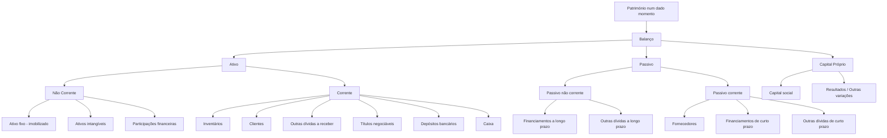

# Notas de aulas - Contabilidade - IAG1

> **Objetivo**: consolidar as tuas notas com terminologia correta, estrutura lógica e pontos de exame frequentes, alinhados com o **SNC – Sistema de Normalização Contabilística**, com referências oficiais/credíveis.

---

## 1) O que é a Contabilidade?

- **Definição nuclear** (ótica financeira): sistema de **registo, mensuração e comunicação** de factos económico-financeiros de uma entidade, preparado para fins gerais (investidores, credores, Estado, etc.). A **Estrutura Conceptual** determina os conceitos e critérios subjacentes às demonstrações financeiras.  
- **Características qualitativas** da informação financeira útil: **relevância** e **representação fiel** (fundamentais); **comparabilidade, verificabilidade, tempestividade e compreensibilidade** (de melhoria).

### 1.1 Sentido estrito vs. sentido amplo
- **Sentido estrito**: “técnica de revelação patrimonial” — regista e representa **todas as transações** que afetam o **património** (ativo, passivo, capital próprio), culminando em demonstrações financeiras (Balanço, DR, DFC, etc.).  
- **Sentido amplo**: inclui práticas e subsistemas **internos** de informação para a gestão (planeamento, controlo, decisão), i.e., **Contabilidade de Gestão**, ainda que **não obrigatória** e **livremente desenhada** pela organização.

---

## 2) Ramos principais

### 2.1 Contabilidade Financeira (externa)
- **Objeto**: registo das operações com terceiros, **modificações do património** e **apuramento de resultados**, para **utilizadores externos** (acionistas, financiadores, fornecedores, reguladores, AT, etc.).  
- **Obrigatoriedade/normas**: é **obrigatória por lei** e segue o **SNC** (NCRF/NCP), harmonizado com a IFRS. Modelos oficiais de **demonstrações financeiras** aprovados por portaria.  
- **Demonstrações financeiras típicas (SNC)**:  
  **Balanço**, **Demonstração dos Resultados** (por naturezas), **Demonstração das Alterações no Capital Próprio**, **Demonstração dos Fluxos de Caixa** e **Anexo/Notas**.  
- **Base de preparação**: **regime do acréscimo**; reconhecimento de **ativos, passivos, capital próprio, rendimentos e gastos** conforme a Estrutura Conceptual.

### 2.2 Contabilidade de Gestão (interna)
- **Sinónimos**: contabilidade **analítica**, **industrial**, **de custos**.  
- **Finalidade**: apurar **custos** de produtos/serviços, analisar **margens/desempenho** por negócio/mercado/centro de responsabilidade; **planear**, **controlar** e **suportar decisões**.  
- **Obrigatoriedade**: **não é obrigatória**; **não está normalizada**—formatos e relatórios **definidos internamente** segundo a estratégia/processos.

> **Exame/Dica**: “Financeira” = fora/obrigatória/padronizada (SNC); “Gestão” = dentro/flexível/orientada à decisão.

---

## 3) Património e Balanço

- **Património** (num dado momento): **conjunto de bens, direitos e obrigações** de uma entidade. Em Balanço, estrutura-se em **Ativo**, **Passivo** e **Capital Próprio** (equação: **Ativo = Passivo + Capital Próprio**).

### 3.1 Elementos (definições de referência)
- **Ativo**: **recurso controlado** pela entidade como resultado de acontecimentos passados, do qual se **esperam benefícios económicos futuros**.  
- **Passivo**: **obrigação presente** proveniente de eventos passados, cuja liquidação se espera que **provoque saída de recursos**.  
- **Capital próprio**: **interesse residual** nos ativos depois de deduzidos todos os passivos.

### 3.2 Classificação corrente vs. não corrente
- O **SNC** exige distinguir **corrente**/**não corrente** no Balanço; a **NCRF 1** define os critérios e estrutura de apresentação.

---

## 4) Mapas e rubricas (exemplos práticos)

### 4.1 Obrigações (lado do financiamento)
- **Aos sócios** → **Capital Próprio**: *Capital social*, *Resultados acumulados/período*, *Outras variações no capital próprio*.  
- **A terceiros** → **Passivo**:  
  - **Não corrente**: *Financiamentos a longo prazo*, *Outras dívidas a longo prazo*.  
  - **Corrente**: *Fornecedores*, *Financiamentos de curto prazo*, *Outras dívidas a curto prazo*.

### 4.2 Bens e direitos (lado dos investimentos)
- **Ativo não corrente**: *Ativo fixo tangível (imobilizado)*, *Ativos intangíveis*, *Participações financeiras*.  
- **Ativo corrente (circulante)**: *Inventários*, *Clientes*, *Outras dívidas a receber*, *Títulos negociáveis*, *Depósitos bancários*, *Caixa*.

---

## 5) Esquema visual (Mermaid)

## 6) Checklist de estudo

- [ ] **Distinguir** Contabilidade **Financeira** vs. **Gestão** (objetivo, utilizadores, obrigatoriedade, normalização).
- [ ] **Definições** de **Ativo/Passivo/Capital Próprio** e **base do acréscimo**.
- [ ] **Modelos do SNC**: reconhecer e saber o propósito de cada um (Balanço, Demonstração de Resultados, Demonstração dos Fluxos de Caixa, Demonstração das Alterações no Capital Próprio, Anexo).
- [ ] **Classificação** corrente vs. não corrente e **exemplos** típicos de rubricas em cada categoria.
- [ ] **Qualidade da informação**: relevância e representação fiel (fundamentais); comparabilidade, verificabilidade, tempestividade e compreensibilidade (de melhoria).

---

## 7) Referências essenciais (consulta rápida)

- **CNC – Comissão de Normalização Contabilística**: Estrutura Conceptual, NCRF 1 e restantes normas; modelos oficiais de demonstrações financeiras.
- **SNC (legislação de base)**: enquadramento legal e princípios (inclui regime do acréscimo e critérios de reconhecimento/medição).
- **IFRS Foundation – Conceptual Framework**: definições dos elementos das demonstrações e características qualitativas.
- **Portaria dos modelos de DF** (Diário da República): formatos padronizados de Balanço, DR, DFC, DAPC e Anexo.
- **Materiais formativos** (OCC, universidades): guias práticos, casos e exercícios.

---

> **Mnemónica útil**  
> **Ativo traz benefícios**; **Passivo exige saídas**; **Capital Próprio é o residual**.  
> **Financeira = fora & normas**; **Gestão = dentro & decisão**.

## Balanço e Factos Patrimoniais

### Factos Patrimoniais
**Definição**: Factos patrimoniais são todas as operações que criam uma dinâmica patrimonial, provocando variações quantitativas e qualitativas no património da empresa, sendo passíveis de se determinar um valor monetário.

**Classificação dos Factos Patrimoniais**:

1. **Factos Patrimoniais Permutativos (Qualitativos ou Compensativos)**
   - Alteram a composição do património sem alterar o seu valor
   - Modificam apenas a natureza dos elementos patrimoniais envolvidos
   - Não afetam o capital próprio

2. **Factos Patrimoniais Modificativos (Quantitativos)**
   - Alteram a composição do património e modificam a situação líquida
   - **Modificativos aumentativos**: aumentam o capital próprio (ex: rendimentos)
   - **Modificativos diminutivos**: diminuem o capital próprio (ex: gastos)

3. **Factos Patrimoniais Mistos (Compostos)**
   - Envolvem simultaneamente um facto permutativo e um facto modificativo
   - Alteram o património líquido através da troca de elementos com lucro ou prejuízo

### Exemplos de Factos Patrimoniais da Aula:

- **Realização do capital social** (Permutativo)
  - Entrada de dinheiro ou outros bens por parte dos sócios
  - Débito: Caixa/Depósitos bancários | Crédito: Capital social

- **Compra, a crédito, de mercadoria para venda (inventário)** (Permutativo)
  - Aumento de ativos (inventário) e passivos (fornecedores)
  - Débito: Mercadorias/Inventários | Crédito: Fornecedores

- **Compra de um computador** (Permutativo se pago a pronto; Misto se com descontos)
  - Aquisição de ativo fixo tangível
  - Débito: Equipamento básico | Crédito: Caixa/Banco ou Fornecedores de imobilizado

- **Pagamento de renda** (Modificativo diminutivo)
  - Gasto que diminui o ativo e o capital próprio
  - Débito: Rendas e alugueres (Classe 6) | Crédito: Caixa/Banco

- **Vender a crédito** (Misto)
  - Aumento de clientes (ativo) e rendimento (capital próprio)
  - Débito: Clientes | Crédito: Vendas de mercadorias (Classe 7)

- **Recebimento do crédito cedido ao cliente** (Permutativo)
  - Diminuição de clientes e aumento de disponibilidades
  - Débito: Caixa/Banco | Crédito: Clientes

---

## Método de Registo Digráfico ou das Partidas Dobradas

**Origem histórica em Portugal**: Em 28 de junho de 1808, a Corte Portuguesa emitiu um decreto que tornou obrigatória a escrituração mercantil por partidas dobradas, descrevendo-a como "a única seguida pelas nações mais civilizadas" devido à sua brevidade no manejo de grandes somas e clareza, deixando menos margem para erros e fraudes.

**Princípio fundamental**:
- Cada transação financeira é registada em pelo menos duas contas, com direções opostas (débitos e créditos)
- O total dos débitos deve ser sempre igual ao total dos créditos
- Garante que a equação contabilística se mantém equilibrada: **Ativo = Passivo + Capital Próprio**

**Equação alternativa**: Capital Próprio = Ativo - Passivo

---

## Contas e Regras de Movimentação

### Contas de Ativo
- **Natureza**: Devedora
- **Débito**: Aumenta o património (entrada de bens ou direitos)
- **Crédito**: Diminui o património (saída de bens ou direitos)
- **Exemplos**: Caixa, Depósitos bancários, Clientes, Inventários, Equipamentos

### Contas de Passivo
- **Natureza**: Credora
- **Débito**: Diminui o património (pagamento de dívidas)
- **Crédito**: Aumenta o património (assunção de obrigações)
- **Exemplos**: Fornecedores, Empréstimos obtidos, Estado e outros entes públicos

### Contas de Gastos (Classe 6)
- **Natureza**: Devedora
- **Débito**: Aumenta os gastos (registo de consumos, despesas)
- **Crédito**: As contas de gasto, por norma, não são creditadas (exceto em regularizações ou anulações)
- **Exemplos**: Custo das mercadorias vendidas, Fornecimentos e serviços externos, Gastos com pessoal

### Contas de Rendimentos (Classe 7)
- **Natureza**: Credora
- **Débito**: Diminui os rendimentos (anulações, devoluções) - raramente utilizado
- **Crédito**: Aumenta os rendimentos (registo de vendas, prestação de serviços)
- **Exemplos**: Vendas de mercadorias, Prestações de serviços, Juros obtidos

### Contas de Capital Próprio (Classe 5)
- **Natureza**: Credora (representa os recursos dos proprietários)
- **Débito**: Diminui o capital próprio (distribuição de lucros, prejuízos, diminuição de capital)
- **Crédito**: Aumenta o capital próprio (realizações de capital, lucros, subsídios)
- **Definição**: O capital próprio é o interesse residual nos ativos da entidade depois de deduzir todos os seus passivos
- **Exemplos**: Capital social, Reservas, Resultados transitados

---

## Apuramento de Resultados

O apuramento de resultados é o processo de determinação do lucro ou prejuízo do exercício, através da comparação entre rendimentos (Classe 7) e gastos (Classe 6).

**Processo**:
1. No final do período, transferem-se todos os saldos das contas de gastos (Classe 6) e rendimentos (Classe 7) para a Classe 8
2. A diferença determina o resultado antes de impostos
3. Deduz-se o imposto sobre o rendimento
4. Obtém-se o resultado líquido do período

**Fórmula**: Resultado Líquido = Rendimentos (Classe 7) - Gastos (Classe 6) - Impostos

---

## Classes de Contas no SNC

O Sistema de Normalização Contabilística (SNC) organiza as contas em 8 classes principais:

- **Classe 1** – Meios Financeiros Líquidos (Caixa, Depósitos bancários)
- **Classe 2** – Contas a Receber e a Pagar (Clientes, Fornecedores, Estado)
- **Classe 3** – Inventários e Ativos Biológicos (Mercadorias, Matérias-primas)
- **Classe 4** – Investimentos (Propriedades de investimento, Ativos fixos tangíveis, Ativos intangíveis)
- **Classe 5** – Capital Próprio (Capital social, Reservas, Resultados transitados)
- **Classe 6** – Gastos (Custo das vendas, Fornecimentos e serviços externos, Gastos com pessoal)
- **Classe 7** – Rendimentos (Vendas, Prestações de serviços, Outros rendimentos)
- **Classe 8** – Resultados (Apuramento de resultados do período)

### Classe 8 - Resultados (Detalhamento)

A Classe 8 é utilizada para determinar o resultado líquido do período e pode auxiliar na determinação do rendimento integral.

**Principais contas da Classe 8**:
- **811** - Resultado antes de impostos: Concentra, no final do período, os gastos e rendimentos registados nas contas das classes 6 e 7
- **8121** - Imposto estimado para o período: Montante estimado de imposto que incidirá sobre os resultados ajustados para efeitos fiscais
- **81** - Resultado líquido do período: Resultado final após dedução de impostos
- **89** - Dividendos antecipados

---

## Plano de Contas

**Definição**: Lista estruturada de contas contabilísticas que serve como referência para o registo das operações da empresa.

**Fonte**: Sistema de Normalização Contabilística (SNC)

**Evolução histórica**:
- **(Antigo) POC** – Plano Oficial de Contabilidade (extinto)
- **SNC** – Sistema de Normalização Contabilística (aprovado pelo Decreto-Lei n.º 158/2009, de 13 de julho)
  - Substituiu o POC em Portugal
  - Alinha a contabilidade portuguesa com as normas internacionais (IAS/IFRS)
  - Administrado pela Comissão de Normalização Contabilística (CNC), sob tutela do Ministério das Finanças

**Componentes do SNC**:
- Código de Contas (Plano de Contas)
- Estrutura Conceptual
- Normas Contabilísticas e de Relato Financeiro (NCRF)
- Modelos de Demonstrações Financeiras
- Norma Contabilística para Microentidades (NCM)
- Normas Interpretativas (NI)

---

## Níveis de Contas (Estrutura Hierárquica)

O Código de Contas do SNC organiza-se numa estrutura hierárquica de quatro níveis:

- **C – Classe de Conta** (1 dígito): Nível mais agregado (ex: Classe 1, 2, 3...)
- **R – Conta Razão** (2 dígitos): Subdivisão da classe (ex: 11 - Caixa, 12 - Depósitos bancários)
- **I – Intermédio** (3 dígitos): Subdivisão da conta razão (ex: 121 - Depósitos à ordem)
- **M – Conta de Movimento** (4 ou mais dígitos): Nível mais detalhado onde são efetivamente registados os movimentos (ex: 1211 - Depósitos à ordem - Banco A)

**Exemplo prático**:
- **4** (Classe) - Investimentos
- **43** (Razão) - Ativos fixos tangíveis
- **433** (Intermédio) - Equipamento básico
- **4331** (Movimento) - Equipamento informático

---

## Balancete

**Definição**: O balancete é um relatório financeiro interno que apresenta o resumo de todas as contas movimentadas pela empresa durante o período, com os respetivos saldos mensais e acumulados.

**Características**:
- **Não é uma demonstração financeira oficial** (não é divulgado publicamente)
- É um **documento de suporte** ao processo de elaboração das demonstrações financeiras
- Representa um **resumo do Razão** (livro onde se registam os movimentos por conta)
- Emitido tipicamente **no final de cada mês**
- Serve de **ponto de partida para as operações de fim de período** (fecho de contas)

**Função**: Verificar se o total dos débitos é igual ao total dos créditos, confirmando o equilíbrio contabilístico (princípio das partidas dobradas)

**Relação entre documentos contabilísticos**:
1. **Diário**: Registo cronológico de todas as operações (por ordem de datas)
2. **Razão**: Registo das operações organizadas por conta
3. **Balancete**: Resumo dos saldos de todas as contas do razão num determinado momento

---

## Sistemas de Informação Contabilísticos

Um sistema de informação contabilístico é composto por:

### 1. Livros de Registo
- **Livro Diário**: Registo cronológico (por ordem de datas) de todos os factos patrimoniais
- **Livro Razão**: Registo das operações organizadas por conta, mostrando os movimentos e saldos de cada uma

### 2. Conjunto de Princípios Contabilísticos
Definidos na Estrutura Conceptual do SNC, incluindo:
- **Regime do acréscimo (periodização económica)**: Os efeitos das transações são reconhecidos quando ocorrem
- **Continuidade**: Pressupõe-se que a empresa continuará em atividade no futuro previsível
- **Consistência**: Os mesmos métodos contabilísticos devem ser aplicados consistentemente
- **Materialidade**: A informação é material se a sua omissão puder influenciar decisões
- **Prudência**: Inclusão de um grau de precaução ao fazer juízos em condições de incerteza
- **Comparabilidade**: Permitir comparar as demonstrações financeiras ao longo do tempo e entre entidades

### 3. Plano de Contas
Código de Contas do SNC, estruturado hierarquicamente (Classes, Razão, Intermédio, Movimento)

### 4. Sistemas Informáticos
Software de contabilidade que integra todos os componentes anteriores e permite:
- Registo automático de lançamentos contabilísticos
- Emissão de balancetes
- Elaboração de demonstrações financeiras
- Cumprimento de obrigações fiscais (SAF-T, IES, Modelo 22, etc.)

---

## Notas Complementares

### Demonstrações Financeiras Oficiais no SNC:
As demonstrações financeiras que as empresas devem preparar e divulgar incluem:
1. **Balanço** (apresenta a situação patrimonial num determinado momento)
2. **Demonstração dos Resultados por Naturezas** (apresenta rendimentos e gastos)
3. **Demonstração das Alterações no Capital Próprio**
4. **Demonstração dos Fluxos de Caixa**
5. **Anexo** (notas explicativas às demonstrações financeiras)

### Equação Fundamental da Contabilidade:
**Ativo = Passivo + Capital Próprio**

Esta equação deve estar sempre equilibrada, refletindo que tudo o que a empresa possui (Ativo) é financiado ou por recursos de terceiros (Passivo) ou por recursos próprios (Capital Próprio).

---

**Fontes de referência**:
- Comissão de Normalização Contabilística (CNC) - www.cnc.min-financas.pt
- Sistema de Normalização Contabilística (SNC) - Decreto-Lei n.º 158/2009
- Ordem dos Contabilistas Certificados (OCC)
- Materiais académicos da Faculdade de Economia do Porto (FEP/FEUP)
