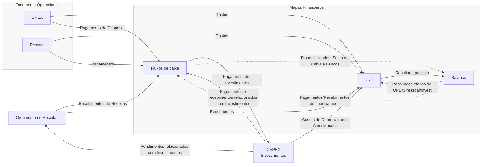

# 📘 MBA Executivo – 10ª Edição (ISAG)

**Disciplina:** Instrumentos de Apoio à Gestão - MBA52
**Docente Responsável:** Nuno Reis
**Tópico:** Orçamento

---

### 🧭 Fonte e Objetivo
Baseado nas **notas de aula de Bruno Lemos Silva**, nos **materiais dos professores do ISAG**, e em **pesquisas complementares de fontes oficiais e fidedignas**.  
O objetivo é **consolidar o conhecimento** e **aplicar os conceitos na prática profissional**, promovendo o crescimento e rigor académico.

---

# Guia de Estudo — Orçamento  
*(Disciplina: Instrumentos de Apoio à Gestão – MBA Executivo ISAG)*  

---

## 🧭 Introdução ao Orçamento Empresarial  

O **orçamento** é um plano financeiro que traduz, em valores monetários, as intenções estratégicas de uma empresa. Funciona como um **mapa de ação** que define **receitas, despesas, gastos e rendimentos** previstos para um determinado período — normalmente um ano.  

Mais do que um simples documento, o orçamento é uma **ferramenta de planeamento e controlo de gestão**, permitindo:  
- Avaliar o desempenho financeiro;  
- Apoiar a tomada de decisões;  
- Estabelecer metas e responsabilidades;  
- Corrigir desvios entre o planeado e o realizado.  

📘 **Exemplo prático:**  
Uma empresa prevê aumentar as vendas em 10% no próximo ano. Para isso, define um orçamento de marketing e contratação que suporte este crescimento, alinhado com o plano estratégico global.  

---

## 🔄 O Processo de Elaboração do Orçamento  

O orçamento segue um **ciclo estruturado**, que vai desde a definição de premissas até ao acompanhamento dos resultados.

### 1. **Premissas**  
São as bases e critérios definidos pela gestão:  
- Estratégia de mercado e crescimento;  
- Novos investimentos;  
- Restrições financeiras ou operacionais;  
- Direção estratégica da empresa.  
➡️ Deve estar sempre **em consonância com o Plano Estratégico**.

### 2. **Projeções**  
Aqui estimam-se os valores previstos para:  
- **Vendas e receitas**;  
- **Custos e despesas**;  
- **Investimentos (CAPEX)**;  
- **Pessoal**;  
- **Recebimentos e pagamentos**.  

Estas projeções podem ser organizadas por:  
- Área de negócio;  
- Departamento;  
- Atividade;  
- Global da empresa.

### 3. **Elaboração dos Mapas Orçamentais**  
São preparados os mapas financeiros principais:  
- Mapa de Vendas;  
- Mapa de Custos;  
- Mapa de Investimentos;  
- Mapa de Pessoal;  
- Mapa de Recebimentos e Pagamentos.

### 4. **Acompanhamento e Controlo**  
Os gestores comparam o **realizado** com o **planeado**, através dos **mapas de execução orçamental**, para identificar **desvios** e aplicar **ações corretivas**.

---

## 📊 Tipos de Orçamento  

### **1. Orçamento Incremental**  
Parte do orçamento anterior, ajustando-o por inflação, crescimento esperado ou valores absolutos.  
✅ Simples de elaborar.  
⚠️ Pode perpetuar ineficiências e gerar projeções superficiais.  

**Exemplo:** aumentar todos os gastos de 2024 em 3% para refletir a inflação de 2025.

---

### **2. Orçamento de Base Zero**  
Constrói-se do zero, **sem referência ao histórico**. Cada gasto é justificado e avaliado com base nas condições atuais.  
✅ Favorece a análise crítica e elimina desperdícios.  
⚠️ Exige tempo e dados detalhados.  

**Exemplo:** cada departamento precisa justificar todas as despesas para o próximo ano, mesmo que já existam de anos anteriores.

---

### **3. Orçamento Matricial**  
Associa responsabilidades cruzadas:  
- Um **responsável global** controla cada tipo de gasto;  
- Um **responsável local** supervisiona os gastos da sua unidade.  
✅ Promove transparência e responsabilidade partilhada.  

**Exemplo:** o responsável financeiro aprova os gastos gerais de TI, mas cada departamento deve validar o uso local.

---

### **4. Orçamento Baseado em Atividades (Activity-Based Budgeting)**  
Baseia-se nas **atividades necessárias** para atingir os objetivos estratégicos.  
✅ Permite medir custos por atividade, aumentando a precisão.  
📚 Deriva do método **Activity-Based Costing (ABC)**.  

**Exemplo:** orçamentar o custo da “instalação de clientes” em vez de apenas o custo total de “serviços técnicos”.

---

### **5. Orçamento Top-Down**  
Definido pela **gestão de topo**, que estabelece diretrizes globais para depois serem desdobradas pelas equipas operacionais.  
✅ Garante alinhamento estratégico.  
⚠️ Pode limitar a visão operacional.  

**Exemplo:** a direção define um aumento global de receitas em 8%, e cada departamento planeia como contribuir para esse objetivo.

---

### **6. Orçamento Bottom-Up**  
Elaborado **pelos diretores operacionais**, que conhecem em detalhe o terreno.  
✅ Reflete a realidade e motiva as equipas.  
⚠️ Pode gerar metas pouco ambiciosas se não houver supervisão.  

**Exemplo:** equipas de loja estimam receitas e despesas com base na experiência do dia a dia.

---

### **7. Orçamento Anual**  
Planeamento para o **ano fiscal seguinte**, iniciado geralmente no **4.º trimestre** do ano anterior.  
✅ Ferramenta tradicional e essencial à gestão.  

---

### **8. Orçamento Contínuo (Rolling Forecast)**  
Processo dinâmico e **permanente de atualização**, mantendo sempre uma previsão para os próximos 12 meses.  
✅ Adapta-se rapidamente às mudanças de mercado.  
⚠️ Requer disciplina e acompanhamento constante.  

---

### **9. Plano Estratégico**  
Define os **objetivos macro** da empresa (3 a 5 anos) e a **estratégia para os atingir**.  
Não é exclusivamente financeiro, mas contém **projeções económicas e financeiras** que servem de base ao orçamento anual.  

### **⚙️ Workflow — Elaboração do Orçamento**

---

## 🧩 Conclusão  

O orçamento é muito mais do que um documento técnico — é uma **ferramenta de gestão estratégica** que integra planeamento, execução e controlo.  
Quando bem elaborado, permite à empresa **alinhar as suas ações operacionais com os objetivos estratégicos**, **antecipar problemas financeiros** e **agir proativamente** no mercado.  

**Em resumo:**  
> “O orçamento transforma a estratégia em números e os números em ação.”

---

### ✍️ Autor e Creditação
Elaborado por **Bruno Lemos Silva**, participante da **10ª Edição do MBA Executivo do ISAG – Instituto Superior de Administração e Gestão**.

### 🕓 Atualização
Última revisão: **outubro de 2025**

### 🧩 Observações
Este guia destina-se exclusivamente a fins de **estudo e desenvolvimento profissional**.  
As informações aqui contidas foram compiladas de forma independente, respeitando os direitos autorais e citando fontes oficiais sempre que aplicável.

> 📑 **Declaração de integridade académica:**  
> Este material não substitui as aulas, notas originais ou manuais fornecidos pelo ISAG.  
> O seu conteúdo visa apenas reforçar o entendimento e promover a aplicação prática dos conceitos abordados durante o curso.
