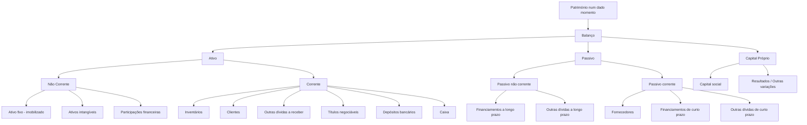

# Direito Comercial (Portugal): Guia de Estudo Resumido e Organizado

> **Objetivo**: consolidar as tuas notas com estrutura clara, terminologia correta e pontos de exame frequentes, alinhados com o **Código das Sociedades Comerciais (CSC)** e fontes oficiais.

---

## 1) Conceitos-base

### 1.0 O que é Direito Comercial?
- **Direito Comercial** é o ramo do direito constituído pelo corpo de **normas**, conceitos e princípios jurídicos que regem os factos e as relações jurídicas **comerciais**.

### 1.1 Comerciante / Empresário
- **Comerciante/empresário** é quem exerce profissionalmente uma atividade económica organizada de produção ou troca de bens/serviços. Em Portugal, a figura típica sem personalidade coletiva é o **Empresário em Nome Individual (ENI)**.

### 1.2 Personalidade jurídica e registo
- **Sociedades comerciais** adquirem **personalidade jurídica** e existem como tais a partir da data do **registo definitivo** do **contrato social** (pacto social) na **Conservatória do Registo Comercial** (não na Conservatória do Registo Civil).
- O registo é condição de oponibilidade a terceiros, sem prejuízo do disposto quanto à constituição de sociedades por fusão, cisão ou transformação de outras.

---

## 2) Formas jurídicas mais comuns

### 2.1 Empresário em Nome Individual (ENI)
- **Titular**: 1 pessoa singular.  
- **Capital mínimo**: **não existe**.  
- **Responsabilidade**: **ilimitada** – não há separação entre património pessoal e o “negócio”.  
- **Firma (nome)**: composta pelo **nome civil** (extenso ou abreviado); pode conter referência ao ramo.

> **Quando usar**: negócios muito simples e de baixo risco.  
> **Risco de exame**: sublinhar a *ausência* de limitação de responsabilidade.

---

### 2.2 Estabelecimento Individual de Responsabilidade Limitada (EIRL)
- **Titular**: 1 pessoa singular.  
- **Capital mínimo**: **€5.000**, realizado em numerário, bens ou direitos suscetíveis de penhora (com parte mínima em numerário).  
- **Responsabilidade**: limitada ao património **afeto** ao estabelecimento (património autónomo).  
- **Firma**: nome do titular **+** (facultativa) referência ao objeto **+** “**Estabelecimento Individual de Responsabilidade Limitada**” ou “**E.I.R.L.**”.

> **Nota**: Forma **residual** atualmente (mais comum optar por **Sociedade Unipessoal por Quotas**).

---

### 2.3 Sociedade Unipessoal por Quotas (SUQ)
- **Sócios**: **1** (pode ser pessoa singular ou coletiva).  
- **Capital**: **livremente fixado**; **mínimo de €1 por quota**.  
- **Responsabilidade**: limitada ao capital.  
- **Firma**: deve incluir **“Sociedade Unipessoal”** ou **“Unipessoal”** **antes** de **“Limitada”**/**“Lda.”**.

> **Dica prática**: opção típica para pequenos negócios com proteção patrimonial e custos de entrada reduzidos.

---

## 3) Sociedades comerciais “pluripessoais”

### 3.1 Sociedade em Nome Coletivo (SNC)
- **Sócios**: ≥ **2**.  
- **Capital**: sem mínimo legal.  
- **Responsabilidade**: **pessoal, ilimitada, subsidiária em relação à sociedade e solidária** entre sócios.  
- **Firma**: nome de um ou mais sócios, com aditamento **“e Companhia” / “e Cia.”** quando nem todos constem.  
- **Voto**: regra do **“voto por cabeça”**: **cada sócio = 1 voto**, salvo estipulação contratual diversa (sem suprimir o direito de voto).  
- **Transmissão da parte social**: **carece do consentimento unânime** dos restantes sócios.

> **Risco de exame**: distinguir **ilimitada/subsidiária/solidária** e a **firma obrigatória** com “e Companhia”.

---

### 3.2 Sociedade por Quotas (Lda.)
- **Sócios**: ≥ **2** (quando 1, é **SUQ**).  
- **Capital**: **livre** (mínimo **€1 por quota**; capital mínimo “global” = nº de sócios × €1).  
- **Responsabilidade**: limitada ao montante das quotas.  
- **Firma**: pode ser de fantasia ou com nomes dos sócios; **tem** de terminar em **“Limitada”/“Lda.”**.  
- **Voto**: **regra capitalística** – **1 voto por cada cêntimo** do valor nominal da quota (salvo estipulação estatutária).

---

### 3.3 Sociedade Anónima (S.A.)
- **Sócios**: regra geral **≥ 5** acionistas (há **exceções legais**—p. ex., possibilidade de sócio único pessoa coletiva em certos casos).  
- **Capital**: **mínimo €50.000** (valor nominal mínimo da ação: €0,01).  
- **Responsabilidade**: limitada ao montante das ações subscritas.  
- **Firma**: deve conter “**Sociedade Anónima**” ou “**S.A.**”.

> **Quando usar**: projetos de maior dimensão, necessidade de acesso a financiamento mais sofisticado/governação estruturada.

---

### 3.4 Sociedade em Comandita
- **Tipos**: **Simples** e **por Ações**.  
- **Sócios**:
  - **Comanditados**: **gerem** e têm **responsabilidade ilimitada** (como na SNC).  
  - **Comanditários**: essencialmente **investidores**, **responsabilidade limitada**.  
- **Representação do capital**:
  - **Simples**: por **partes**.  
  - **Por Ações**: por **ações** (regime próximo da S.A.).  
- **Firma**: inclui o nome de pelo menos um **comanditado** + aditamento **“em comandita”** / **“em comandita por ações”**.

---

## 4) Regras sobre a **firma** (nome da empresa)

### 4.1 O que é a "Firma"?

Em Direito Comercial, o termo **"Firma"** significa:
- **Designação ou nome comercial de uma empresa** (não confundir com "assinatura" ou com o conceito coloquial de "empresa").
- **"Firma" ≠ "sociedade"**: "firma" é **o nome**, não a entidade jurídica em si.

### 4.2 Regras de composição por tipo de sociedade

| Tipo | Regra de Firma | Exemplo |
|---|---|---|
| **ENI** | Nome civil (extenso/abreviado) + facultativamente referência ao ramo | *João Pais de Almeida - Comércio de Papel Higiénico* |
| **EIRL** | Nome do titular + (facultativa) referência ao objeto + **"E.I.R.L."** ou por extenso | *Neide Margarete, Pronto-a-vestir, E.I.R.L.* |
| **SUQ** | Nome fantasia ou dos sócios + **"Unipessoal"** + **"Lda."** ou **"Limitada"** | *Lavandaria Roupa Limpa, Unipessoal Lda.* |
| **SNC** | Nome de um ou mais sócios + **"e Companhia"/"e Cia."** (quando não constem todos) | *Pais Ribeiro, Filhos e Cia.* |
| **Lda.** | Nome fantasia ou dos sócios + **"Lda."** ou **"Limitada"** (sem "Unipessoal") | *Transportes Unipessoais, Lda.* (nome fantasia) |
| **S.A.** | Nome fantasia ou dos sócios + **"S.A."** ou **"Sociedade Anónima"** | *Modelo Continente, S.A.* |
| **Comandita** | Nome de pelo menos um **comanditado** + **"em comandita"** ou **"em comandita por ações"** | *Silva & Comandita* |

### 4.3 Pontos de atenção (frequentes em exame)

- ⚠️ **SUQ vs Lda. pluripessoal**: A palavra "**Unipessoal**" só aparece na firma de **Sociedade Unipessoal por Quotas**, **antes** de "Lda.".
- ⚠️ Uma Lda. com vários sócios pode ter um nome fantasia que contenha a palavra "Unipessoal" (ex: "Transportes Unipessoais, Lda."), mas isso **não** significa que seja uma SUQ — é apenas um nome comercial.
- ⚠️ **Regra geral**: *firma* associa-se a comerciantes/sociedades comerciais; *denominação social* a entidades não comerciais (associações, fundações).

---

## 5) Contrato de sociedade (pacto social): conteúdos essenciais

> **Definição**: documento jurídico que cria a sociedade e estabelece as suas regras internas.

### 5.1 Elementos obrigatórios do contrato de sociedade

O contrato de sociedade, **seja qual for o seu tipo**, deve obrigatoriamente conter:

✅ **Tipo de Sociedade** (ENI, EIRL, SUQ, SNC, Lda., S.A., Comandita)
✅ **Firma** (designação/nome comercial)
✅ **Sede** (localização da sociedade)
✅ **Objeto Social** (atividade(s) a desenvolver)
✅ **Montante afeto ao Capital Social** (valor do capital)
✅ **Participação dos sócios** (distribuição de quotas/ações/partes)
✅ **Responsabilidade de cada sócio** (limitada ou ilimitada)
✅ **Designação do Gerente** ou órgão de administração

### 5.2 Outros conteúdos relevantes (boas práticas)

- **Regras de voto e deliberação** (incluindo *direitos especiais*, quóruns, maioria)
- **Transmissão** de quotas/partes/ações e **consentimentos** aplicáveis (p. ex., **unanimidade na SNC**)
- **Cláusulas de saída** e **resolução de litígios**
- **Duração** e **causas de dissolução**

> ⚠️ **Nota de exame**: O contrato **NÃO** precisa de incluir obrigatoriamente o "Nome e cédula profissional do Contabilista Certificado" nem a "Escolha dos títulos representativos do Capital Social" — estes são elementos facultativos ou regulados separadamente.

---

## 6) Quadro comparativo rápido

| Sigla | Designação Completa | Nº Sócios | Capital Mínimo | Responsabilidade | Regime de Voto | Exemplo de Firma |
|---|---|---:|---|---|---|---|
| **ENI** | **Empresário em Nome Individual** | 1 | Não existe | **Ilimitada** (todo o património pessoal) | N/A | *João Pais de Almeida - Comércio de Papel Higiénico* |
| **EIRL** | **Estabelecimento Individual de Responsabilidade Limitada** | 1 | **€5.000** | **Limitada** ao património afeto | N/A | *Neide Margarete, Pronto-a-vestir, E.I.R.L.* |
| **SUQ** | **Sociedade Unipessoal por Quotas** | 1 | Livre (fixado pelos sócios; ≥ €1/quota) | **Limitada** ao capital | Capitalístico (€1 = 1 voto) | *Lavandaria Roupa Limpa, Unipessoal Lda.* |
| **SNC** | **Sociedade em Nome Coletivo** | ≥ 2 | Não existe | **Ilimitada, subsidiária** e **solidária** | **Voto por cabeça** (1 sócio = 1 voto) | *Pais Ribeiro, Filhos e Cia.* |
| **Lda.** | **Sociedade por Quotas** | ≥ 2 | Livre (fixado pelos sócios; ≥ €1/quota) | **Limitada** ao capital | Capitalístico (€0,01 = 1 voto) | *Transportes Unipessoais, Lda.* |
| **S.A.** | **Sociedade Anónima** | ≥ 5 (regra geral) | **€50.000** | **Limitada** ao capital | Capitalístico (por ação) | *Modelo Continente, S.A.* |
| **Comandita Simples** | **Sociedade em Comandita Simples** | ≥ 2 | Variável | **Comanditados**: ilimitada **Comanditários**: limitada | Conforme contrato | *Silva & Comandita* |
| **Comandita por Ações** | **Sociedade em Comandita por Ações** | ≥ 2 | Variável | **Comanditados**: ilimitada **Comanditários**: limitada | Capitalístico (ações) | *Silva & Comandita por Ações* |

### Notas importantes do quadro:

- **ENI**: Afeta **todo o património pessoal**; ideal apenas para negócios de muito baixo risco.
- **EIRL**: Capital mínimo obrigatório de **€5.000** (em numerário, bens ou direitos penhoráveis).
- **SUQ**: A palavra "**Unipessoal**" deve aparecer **antes** de "Lda." na firma (ex: "*Nome*, Unipessoal Lda.").
- **Lda. (pluripessoal)**: **NÃO** leva a palavra "Unipessoal" (ex: "*Transportes Unipessoais*, Lda." — nome fantasia, não significa que é unipessoal).
- **SNC**: Responsabilidade **subsidiária** = credores executam primeiro a sociedade; **solidária** = podem executar qualquer sócio pelo total da dívida.
- **S.A.**: Valor nominal mínimo da ação = **€0,01**.
- **Comandita**: **Comanditados** = gerem e respondem ilimitadamente; **Comanditários** = investem e respondem de forma limitada.

---

## 7) Perguntas típicas de avaliação (com *dicas-flash*)

### 7.1 Questões de múltipla escolha (baseadas em exames anteriores)

**Q1:** Nas Sociedades em Comandita, os sócios investidores designam-se por:
- ✅ **Sócios Comanditários** (investem, responsabilidade limitada)
- ❌ Sócios Comanditados (gerem, responsabilidade ilimitada)

**Q2:** A firma de uma Sociedade por Quotas deve conter a palavra "Unipessoal" antes da abreviatura "Lda.".
- ✅ **FALSO** — Apenas a **Sociedade Unipessoal por Quotas (SUQ)** leva "Unipessoal" na firma; a Lda. com 2 ou mais sócios **não** leva.

**Q3:** O Capital Social de um Estabelecimento Individual de Responsabilidade Limitada não pode ser inferior a:
- ✅ **€5.000**

**Q4:** O Capital Social de uma Sociedade por Quotas pode ser fixado pelos sócios.
- ✅ **VERDADEIRO** — O capital é livremente fixado, desde que respeite o mínimo de €1 por quota.

**Q5:** Em Direito Comercial, o termo "Firma" significa:
- ✅ **Designação ou nome comercial de uma empresa**
- ❌ Assinatura / Sociedade / Empresa enquanto entidade

**Q6:** A personalidade jurídica de uma empresa em Portugal é formalmente estabelecida através de um processo de registo junto da:
- ✅ **Conservatória do Registo Comercial**
- ❌ Conservatória do Registo Civil

**Q7:** Um indivíduo pretende iniciar uma atividade comercial à qual pretende afetar **todo o seu património pessoal**. Por que tipo de empresa deve optar?
- ✅ **Empresário em Nome Individual (ENI)** — única opção sem separação patrimonial

### 7.2 Questões de desenvolvimento

1) **SNC**: Explique "ilimitada, subsidiária e solidária" e as consequências na execução por credores.
   - **Resposta-tipo**: Ilimitada = sócios respondem com todo o seu património; Subsidiária = credores executam primeiro a sociedade, depois os sócios; Solidária = qualquer sócio pode ser executado pelo total da dívida.

2) **Lda. vs SNC**: Capital mínimo e regime de voto (*capitalístico* vs *por cabeça*).
   - **Resposta-tipo**: Lda. = capital livre, voto capitalístico (€0,01 = 1 voto); SNC = sem capital mínimo, voto por cabeça (1 sócio = 1 voto).

3) **SUQ vs ENI**: Diferenças na responsabilidade e na firma.
   - **Resposta-tipo**: SUQ = responsabilidade limitada, firma com "Unipessoal Lda."; ENI = responsabilidade ilimitada, firma com nome civil.

4) **S.A.**: Nº mínimo de sócios e capital mínimo legal.
   - **Resposta-tipo**: Regra geral ≥ 5 sócios; capital mínimo €50.000.

5) **Comandita**: Quem gere e quem investe; quem responde ilimitadamente.
   - **Resposta-tipo**: Comanditados gerem e respondem ilimitadamente; Comanditários investem e respondem de forma limitada.

---

## 8) Referências selecionadas (consulta rápida)

- **Código das Sociedades Comerciais (CSC)** — *Diário da República Eletrónico*.  
- **Capital social (mínimos legais)** — justiça.gov.pt.  
- **SNC — responsabilidade e firma** — gov.pt (Balcão do Empreendedor) + IRN.  
- **S.A. — constituição (≥ 5 sócios)** — gov.pt.  
- **SUQ — regras chave (firma, capital)** — justiça.gov.pt.  
- **EIRL — capital mínimo e regras** — gov.pt.  
- **Firma vs denominação social** — IRN (Instituto dos Registos e Notariado).

---

## 9) Exercício prático: correspondência firma ↔ tipo de sociedade

**Instruções:** Faz corresponder cada firma ao tipo correto de sociedade/empresa.

| Firma | Tipo de Sociedade |
|---|---|
| *Lavandaria Roupa Limpa, Unipessoal Lda.* | **Sociedade Unipessoal por Quotas (SUQ)** |
| *Transportes Unipessoais, Lda.* | **Sociedade por Quotas (Lda.)** — nome fantasia, não é unipessoal |
| *João Pais de Almeida - Comércio de Papel Higiénico* | **Empresário em Nome Individual (ENI)** |
| *Neide Margarete, Pronto-a-vestir, E.I.R.L.* | **Estabelecimento Individual de Responsabilidade Limitada (EIRL)** |
| *Pais Ribeiro, Filhos e Cia.* | **Sociedade em Nome Coletivo (SNC)** |
| *Modelo Continente, S.A.* | **Sociedade Anónima (S.A.)** |

### Pistas para identificação rápida:

- 🔍 **"Unipessoal Lda."** → SUQ
- 🔍 **"Lda." sem "Unipessoal"** → Lda. (pluripessoal)
- 🔍 **Nome de pessoa + atividade (sem sufixo societário)** → ENI
- 🔍 **"E.I.R.L."** ou por extenso → EIRL
- 🔍 **"e Companhia" / "e Cia."** → SNC
- 🔍 **"S.A."** ou "Sociedade Anónima" → S.A.
- 🔍 **"em comandita"** → Sociedade em Comandita

---

## 10) Mini-checklist para estudo/consulta

- [ ] Sei definir **Direito Comercial** e o conceito de **firma**.
- [ ] Conheço a diferença entre **Conservatória do Registo Comercial** e **Civil**.
- [ ] Identifico **nº de sócios**, **capital mínimo**, **responsabilidade** e **firma** por **tipo**.
- [ ] Distingo **Comanditários** (investidores, limitada) de **Comanditados** (gestores, ilimitada).
- [ ] Sei quando o **consentimento unânime** é exigido para **transmissão** (p. ex., **SNC**).
- [ ] Distingui **ENI/SUQ** em **responsabilidade** e **património**.
- [ ] Recordo o **voto por cabeça** (SNC) e **voto capitalístico** (Lda.).
- [ ] Sei que **apenas a SUQ** leva "Unipessoal" antes de "Lda." na firma.
- [ ] Conheço os **elementos obrigatórios** do contrato de sociedade.
- [ ] Lembro que o capital da **EIRL** não pode ser inferior a **€5.000**.
- [ ] Sei que a **Lda. pode ter capital livremente fixado** pelos sócios (mínimo €1/quota).

---

> **Sugestão de memorização**:  
> **E**NI = **E**u (1 só), **E**xposto (ilimitado).  
> **S**UQ = **S**ó **U**m **Q**uotista (1), **S**eguro (limitado).  
> **S**NC = **S**ócios **N**a **C**ara (nome na firma) e **N**ão limitam a responsabilidade.  
> **Lda.** = **L**imita-se. **S.A.** = **S**ubstancial **A**porte (€50k) e ações.  
> **Comandita** = **Comanditado** comanda (ilimitado); **Comanditário** contribui (limitado).

---

# Contabilidade (Portugal): Guia de Estudo Estruturado

> **Objetivo**: consolidar as tuas notas com terminologia correta, estrutura lógica e pontos de exame frequentes, alinhados com o **SNC – Sistema de Normalização Contabilística**, com referências oficiais/credíveis.

---

## 1) O que é a Contabilidade?

- **Definição nuclear** (ótica financeira): sistema de **registo, mensuração e comunicação** de factos económico-financeiros de uma entidade, preparado para fins gerais (investidores, credores, Estado, etc.). A **Estrutura Conceptual** determina os conceitos e critérios subjacentes às demonstrações financeiras.  
- **Características qualitativas** da informação financeira útil: **relevância** e **representação fiel** (fundamentais); **comparabilidade, verificabilidade, tempestividade e compreensibilidade** (de melhoria).

### 1.1 Sentido estrito vs. sentido amplo
- **Sentido estrito**: “técnica de revelação patrimonial” — regista e representa **todas as transações** que afetam o **património** (ativo, passivo, capital próprio), culminando em demonstrações financeiras (Balanço, DR, DFC, etc.).  
- **Sentido amplo**: inclui práticas e subsistemas **internos** de informação para a gestão (planeamento, controlo, decisão), i.e., **Contabilidade de Gestão**, ainda que **não obrigatória** e **livremente desenhada** pela organização.

---

## 2) Ramos principais

### 2.1 Contabilidade Financeira (externa)
- **Objeto**: registo das operações com terceiros, **modificações do património** e **apuramento de resultados**, para **utilizadores externos** (acionistas, financiadores, fornecedores, reguladores, AT, etc.).  
- **Obrigatoriedade/normas**: é **obrigatória por lei** e segue o **SNC** (NCRF/NCP), harmonizado com a IFRS. Modelos oficiais de **demonstrações financeiras** aprovados por portaria.  
- **Demonstrações financeiras típicas (SNC)**:  
  **Balanço**, **Demonstração dos Resultados** (por naturezas), **Demonstração das Alterações no Capital Próprio**, **Demonstração dos Fluxos de Caixa** e **Anexo/Notas**.  
- **Base de preparação**: **regime do acréscimo**; reconhecimento de **ativos, passivos, capital próprio, rendimentos e gastos** conforme a Estrutura Conceptual.

### 2.2 Contabilidade de Gestão (interna)
- **Sinónimos**: contabilidade **analítica**, **industrial**, **de custos**.  
- **Finalidade**: apurar **custos** de produtos/serviços, analisar **margens/desempenho** por negócio/mercado/centro de responsabilidade; **planear**, **controlar** e **suportar decisões**.  
- **Obrigatoriedade**: **não é obrigatória**; **não está normalizada**—formatos e relatórios **definidos internamente** segundo a estratégia/processos.

> **Exame/Dica**: “Financeira” = fora/obrigatória/padronizada (SNC); “Gestão” = dentro/flexível/orientada à decisão.

---

## 3) Património e Balanço

- **Património** (num dado momento): **conjunto de bens, direitos e obrigações** de uma entidade. Em Balanço, estrutura-se em **Ativo**, **Passivo** e **Capital Próprio** (equação: **Ativo = Passivo + Capital Próprio**).

### 3.1 Elementos (definições de referência)
- **Ativo**: **recurso controlado** pela entidade como resultado de acontecimentos passados, do qual se **esperam benefícios económicos futuros**.  
- **Passivo**: **obrigação presente** proveniente de eventos passados, cuja liquidação se espera que **provoque saída de recursos**.  
- **Capital próprio**: **interesse residual** nos ativos depois de deduzidos todos os passivos.

### 3.2 Classificação corrente vs. não corrente
- O **SNC** exige distinguir **corrente**/**não corrente** no Balanço; a **NCRF 1** define os critérios e estrutura de apresentação.

---

## 4) Mapas e rubricas (exemplos práticos)

### 4.1 Obrigações (lado do financiamento)
- **Aos sócios** → **Capital Próprio**: *Capital social*, *Resultados acumulados/período*, *Outras variações no capital próprio*.  
- **A terceiros** → **Passivo**:  
  - **Não corrente**: *Financiamentos a longo prazo*, *Outras dívidas a longo prazo*.  
  - **Corrente**: *Fornecedores*, *Financiamentos de curto prazo*, *Outras dívidas a curto prazo*.

### 4.2 Bens e direitos (lado dos investimentos)
- **Ativo não corrente**: *Ativo fixo tangível (imobilizado)*, *Ativos intangíveis*, *Participações financeiras*.  
- **Ativo corrente (circulante)**: *Inventários*, *Clientes*, *Outras dívidas a receber*, *Títulos negociáveis*, *Depósitos bancários*, *Caixa*.

---

## 5) Esquema visual (Mermaid)

## 6) Checklist de estudo

- [ ] **Distinguir** Contabilidade **Financeira** vs. **Gestão** (objetivo, utilizadores, obrigatoriedade, normalização).
- [ ] **Definições** de **Ativo/Passivo/Capital Próprio** e **base do acréscimo**.
- [ ] **Modelos do SNC**: reconhecer e saber o propósito de cada um (Balanço, Demonstração de Resultados, Demonstração dos Fluxos de Caixa, Demonstração das Alterações no Capital Próprio, Anexo).
- [ ] **Classificação** corrente vs. não corrente e **exemplos** típicos de rubricas em cada categoria.
- [ ] **Qualidade da informação**: relevância e representação fiel (fundamentais); comparabilidade, verificabilidade, tempestividade e compreensibilidade (de melhoria).

---

## 7) Referências essenciais (consulta rápida)

- **CNC – Comissão de Normalização Contabilística**: Estrutura Conceptual, NCRF 1 e restantes normas; modelos oficiais de demonstrações financeiras.
- **SNC (legislação de base)**: enquadramento legal e princípios (inclui regime do acréscimo e critérios de reconhecimento/medição).
- **IFRS Foundation – Conceptual Framework**: definições dos elementos das demonstrações e características qualitativas.
- **Portaria dos modelos de DF** (Diário da República): formatos padronizados de Balanço, DR, DFC, DAPC e Anexo.
- **Materiais formativos** (OCC, universidades): guias práticos, casos e exercícios.

---

> **Mnemónica útil**  
> **Ativo traz benefícios**; **Passivo exige saídas**; **Capital Próprio é o residual**.  
> **Financeira = fora & normas**; **Gestão = dentro & decisão**.
